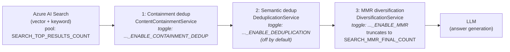

# CP AI RAG Service

A multi-module Azure Functions project for AI-powered Retrieval-Augmented Generation (RAG) service.
This service processes documents through ingestion, retrieval, and scoring workflows using Azure AI services.

## Architecture

This mono-repo contains five independent Azure Functions, a shared library, and an integration test module:

### Functions

| Module | Purpose |
|--------|---------|
| `ai-document-metadata-check-function` | Issues SAS upload URLs via HTTP `POST /document-upload`; blob triggers then validate metadata and enqueue files for ingestion |
| `ai-document-ingestion-function` | Orchestrates document preprocessing, chunking, embedding generation, and vector storage |
| `ai-document-answer-retrieval-function` | Processes client queries, performs retrieval/grounding, and generates answer summaries |
| `ai-document-answer-scoring-function` | Scores generated responses and records telemetry in Azure Monitor |
| `ai-document-status-check-function` | HTTP GET endpoint to look up document ingestion status by document reference |

### Supporting Modules

| Module | Purpose |
|--------|---------|
| `ai-document-shared-artefacts` | Shared utilities, models (including OpenAPI-generated), entity classes, and Azure service clients |
| `ai-service-orchestration-test` | Integration tests using REST Assured, Testcontainers, and Awaitility |

## Architecture & Data Flow

### Document Ingestion Pipeline

The metadata-check module exposes an HTTP-initiated SAS upload flow that feeds the document-ingestion queue and the downstream worker.

**HTTP-initiated SAS upload** (two-step):
1. Caller calls `DocumentUploadFunction` (`POST /document-upload`, `@FunctionName("InitiateDocumentUpload")`) with a `DocumentUploadRequest` (documentId, documentName, metadata, overwrites). The function validates the request, rejects duplicates, records an "awaiting upload" row in Table Storage, and returns an upload SAS URL (issued by `BlobClientService` against the document-upload container) together with the documentId. The SAS URL is scoped to the **single target blob** (create/write/read — no list or delete, HTTPS only, user-delegation key rather than an account key) and is short-lived: it expires after `SAS_STORAGE_URL_EXPIRY_MINUTES` (default `120`), so the caller must complete the upload within that window or initiate a new upload.
2. Caller PUTs the file bytes directly to the returned SAS URL.
3. The blob landing in the upload container fires `DocumentBlobTriggerFunction` (`@FunctionName("DocumentUploadCheck")`), which checks the file size, updates the Table Storage row, and enqueues an ingestion message.

**Downstream:**
- `DocumentIngestionFunction` (ingestion-function, queue-triggered) consumes the queue and runs `DocumentIngestionOrchestrator`:
  - Azure Document Intelligence extracts text content
  - Content is chunked by `DocumentChunkingService` (uses LangChain4J's recursive `DocumentSplitter`)
  - Embeddings generated via Azure OpenAI
  - Chunks + embeddings stored in Azure AI Search index

### Query & Answer Generation Pipeline

The answer-retrieval module exposes two HTTP invocation modes plus the queue-triggered async worker.

**Synchronous** — single HTTP round-trip:
- `SyncAnswerGenerationFunction` (`POST` `AnswerRetrieval`) — embeds the query (`EmbedDataService`), retrieves chunks (`AzureAISearchService`), calls Azure OpenAI via `ResponseGenerationService`/`ChatService`, and returns the generated answer in the HTTP response. Also enqueues a scoring message to the answer-scoring queue.

**Asynchronous** — request/poll across three functions:
1. `InitiateAnswerGenerationFunction` (`POST /answer-user-query-async`) validates the request, writes a pending row to Table Storage, enqueues a payload to the answer-generation queue, and returns a `transactionId`.
2. `AnswerGenerationFunction` (queue-triggered) consumes the message, runs the same embed → search → LLM flow, persists the result payload to Blob Storage, updates Table Storage status, and enqueues a scoring message.
3. `GetAnswerGenerationResultFunction` (`GET /answer-user-query-async-status/{transactionId}`) is the polling endpoint clients call to retrieve the generated answer once ready.

### Retrieval Refinement (Deduplication & Diversification)

Both invocation modes share the same retrieval path in `AzureAISearchService.search()`. It over-fetches a candidate pool from Azure AI Search (vector + keyword), then runs three **independently toggled** post-retrieval stages, **in order**, before the chunks reach the LLM. Azure AI Search has no server-side dedup/diversity operator, so this is performed client-side. `AzureAISearchService` itself is agnostic of the toggles — it always retrieves the `chunkVector` column and each stage decides whether to act:



Each stage passes the list through unchanged when its toggle is off.

1. **`ContentContainmentService` — information-safe deduplication.** Drops a chunk only when (nearly) all of its content already appears in a higher-ranked retained chunk, using an asymmetric word n-gram *containment* test. This collapses duplicate copies of the same passage that legitimately live in different files — these cannot be deduplicated at ingestion because per-file provenance and per-file filtering must be preserved — while **never discarding a chunk that carries unique information** (for example, a "copy + extra crucial sentence" superset is kept and the plain copies drop in its favour).
2. **`DeduplicationService` — semantic (cosine) deduplication.** A coarser, symmetric embedding-similarity filter. **Off by default**, because being symmetric it can drop a near-duplicate that actually carries unique content; it is superseded by containment dedup.
3. **`DiversificationService` — MMR diversification.** Selects a relevance-vs-diversity balanced subset (Maximal Marginal Relevance) and truncates to the final number of chunks sent to the LLM, reducing token usage and surfacing the unique chunks rather than many copies of the shared content.

Cross-file duplication only appears when a query's metadata filter spans multiple files; with a single-file filter there is little for these stages to collapse.

### Scoring
- `AnswerScoringFunction` evaluates answer groundedness via `ScoringService`
- `PublishScoreService` records metrics to Azure Monitor

## Prerequisites

- Java 21
- Maven 3.3.9 or higher
- Azure Functions Core Tools (for local development)

## Local Development Setup

1. **Clone the repository**
   ```bash
   git clone <repository-url>
   cd cp-ai-rag-service
   ```

2. **Create local configuration files**
   ```bash
   # Copy sample configuration files for each function
   cp ai-document-metadata-check-function/Azure/local.settings.sample.json ai-document-metadata-check-function/Azure/local.settings.json
   cp ai-document-ingestion-function/Azure/local.settings.sample.json ai-document-ingestion-function/Azure/local.settings.json
   cp ai-document-answer-retrieval-function/Azure/local.settings.sample.json ai-document-answer-retrieval-function/Azure/local.settings.json
   cp ai-document-answer-scoring-function/Azure/local.settings.sample.json ai-document-answer-scoring-function/Azure/local.settings.json
   cp ai-document-status-check-function/Azure/local.settings.sample.json ai-document-status-check-function/Azure/local.settings.json
   ```

3. **Configure your local settings**
Edit each `local.settings.json` file and replace placeholder values with your actual Azure service credentials:
    - Azure Storage endpoints (storage-account access is managed-identity only; `AzureWebJobsStorage` remains the Functions host runtime store)
    - Azure Search endpoint
    - Azure OpenAI endpoint, API key, and deployment name
    - Application Insights instrumentation key
    - Azure Monitor connection string
   

4. **Build the project**
   ```bash
   mvn clean compile
   ```

5. **Run individual functions locally**
   ```bash
   # Navigate to a specific function directory
   cd ai-document-metadata-check-function
   
   # Run the function locally
   mvn azure-functions:run
   ```

## Building and Testing

### Build All Modules
```bash
mvn clean compile
```

### Run Tests
```bash
mvn test
```

### Package
```bash
mvn clean package
```

## Required Azure Resources

The functions depend on the following Azure resources being available in the target environment:
- Azure Storage Account (blob storage, tables, and queues)
- Azure AI Search Service
- Azure OpenAI Service
- Azure Document Intelligence
- Application Insights / Azure Monitor

## Related Repositories

This repo holds only the function code. The API contract, the Azure infrastructure the
functions run against, and the per-environment deployment configuration live in
separate repositories:

| Repository | What lives there | When you need it |
|---|---|---|
| [`hmcts/api-cp-ai-rag`](https://github.com/hmcts/api-cp-ai-rag) | The OpenAPI 3.0 contract (`ai-rag-service.openapi.yml`). Source of truth for every HTTP request/response shape; the `uk.gov.hmcts.cp.openapi` models here are generated from it. | Any change to an HTTP endpoint — update the spec first, then realign the models and implementation. |
| [`hmcts/cpp-terraform-azurerm-azure-ai-foundry`](https://github.com/hmcts/cpp-terraform-azurerm-azure-ai-foundry) | Terraform for the Azure AI Foundry estate: AI Services account, **model deployments** (name, model version, SKU, **capacity**, RAI/content-filter policy), AI Search **and the search index itself** (created from this repo's `vector-db-index-schema.json` at the git tag named by `ai_search_index_tag`), Document Intelligence. It also owns the RAG **data** storage account `sa<env>01airag` (document / eval-payload containers and their lifecycle purge rules), the role assignments that let the function-app identities reach it, and the Key Vault secrets holding its endpoints. Per-environment values in `vars/<env>.tfvars`; nonlive (dev/sit/nft/ste) and live (prp/prx/prd) subscriptions have separate pipelines. | Adding or resizing a model deployment, changing the tokens-per-minute rate limit (`capacity` × 1,000 = TPM), changing a content-filter policy, rolling out an index schema change, or adding a blob container. Live environments share one regional quota pool per model/SKU. |
| [`hmcts/cpp-module-terraform-azurerm-azure-ai-foundry`](https://github.com/hmcts/cpp-module-terraform-azurerm-azure-ai-foundry) | The reusable module the repo above consumes. `ai-model.tf` creates one `azurerm_cognitive_deployment` per `model_deployments` entry. | Changing *how* deployments are created (new attribute, policy wiring) rather than their values. |
| [`hmcts/cpp-terraform-functionapp-deployment`](https://github.com/hmcts/cpp-terraform-functionapp-deployment) | Terraform for the **function app infrastructure** per environment (`vars/<env>/ccm01-airag.tfvars`): resource group, delegated subnets/NSG, the Functions-runtime storage account and content shares, the user-assigned identity `mi-<env>-ccm01-airag`, Log Analytics + App Insights, the five function apps with their App Service plans (SKU, Java 21, Functions v4), Event Grid topics, dashboard and alerts. | Adding a function app, resizing a plan, changing networking or identity. Not for day-to-day releases — its `functionapp_package` URL is a one-off bootstrap deploy. |
| [`hmcts/cpp-functionapp-deployment`](https://github.com/hmcts/cpp-functionapp-deployment) | Per-environment **function app settings** and the **released version** deployed to each app (`vars/<env>/ccm01-airag.tfvars`). The pipeline downloads the release zip from Artifactory and pushes it with `az functionapp deployment source config-zip`; settings go in with `az functionapp config appsettings set`. | Changing an environment variable for a deployed function (retries, timeouts, feature flags, deployment names) or promoting a release. The function apps themselves come from `cpp-terraform-functionapp-deployment` above. |
| [`hmcts/cpp-azure-api-management`](https://github.com/hmcts/cpp-azure-api-management) | APIM policies that front the HTTP functions, including the internal client-identity header injection (multi-client isolation). | Changing how callers are authenticated or what APIM injects into requests. |
| [`hmcts/cpp-azure-devops-templates`](https://github.com/hmcts/cpp-azure-devops-templates) | Shared Azure DevOps pipeline templates consumed by `azure-pipelines.yaml`. | CI behaviour that is not controlled from this repo's pipeline file. |

## Build, Release & Deployment Pipelines

Four Azure DevOps pipelines, spread over this repo and three Terraform repos, take a change
from pull request to a running environment. None of them is run from a local machine; the
three deployment pipelines are **manual** runs against a chosen environment, each with a
Terraform plan stage followed by an approval-gated apply stage (the shared
`pipelines/terraform-ws-plan-and-apply.yaml` template from `cpp-azure-devops-templates`,
whose apply job is bound to the Azure DevOps environment `<platform>_apply`).

### 1. Build & release — this repo (`azure-pipelines.yaml`)

The pipeline file only selects a shared template from `cpp-azure-devops-templates`; the
steps live there.

| Trigger | Template | What happens |
|---|---|---|
| Pull request | `pipelines/context-verify.yaml` | `mvn verify sonar:sonar` on an AKS agent, then the SonarQube quality-gate status is posted back to the PR. For this repo the template also activates `-P ai-rag-integration-test`, logs in with the `airag-var` service principal and exports the dev Azure endpoints, so the **integration suite runs against real dev Azure on every PR** (the suite in `ai-service-orchestration-test`, `-P ai-rag-integration-test`, skipped by default locally). |
| Merge to `main` | `pipelines/context-validation.yaml` | The **release build**. `jgitflow:release-start` from the merge commit, `mvn clean deploy -DskipTests` to the internal Artifactory (`repocentral`), SonarQube, then `jgitflow:release-finish`: the `dev/release-<version>` branch is merged into `dev/release`, tagged `v<version>`, the release artefacts are signed and deployed, and `main` is bumped to the next `-SNAPSHOT`. **Every merge to `main` therefore cuts a release.** The Docker/AKS validation-stack steps in that template are skipped for this repo. A follow-on job builds the migration-tool image (`ai-rag-migration:<version>`, from `ai-document-migration-tool/Dockerfile`) into the nonlive ACR and promotes it to the live ACR. |

**The artefact.** Each function module's `maven-assembly-plugin` (`src/main/assembly/zip.xml`)
zips the staged function app (`target/azure-functions/<app-name>`, produced by
`azure-functions-maven-plugin:package`) into `<module>-<version>.zip` during `verify`. That
zip is uploaded next to the jar under
`uk/gov/moj/cp/azure/ragservice/<module>/<version>/` and is what the deployment pipeline
below fetches. The migration tool ships a `-dist.tar.gz` (app jar + `lib/`) instead, which
its Dockerfile pulls from the same Artifactory path.

### 2. Function app infrastructure — `cpp-terraform-functionapp-deployment`

Pipeline **"CPP Azure FunctionApp Deployment"**. Parameters: `platform` (`nonlive`/`live`),
`environment`, and `functionapp`, which names the tfvars file — `ccm01-airag` selects
`vars/<env>/ccm01-airag.tfvars`. A PR runs terraform pre-commit checks only; a manual run
does plan → approved apply. It provisions everything the functions run *on*: resource group
`rg-<env>-ccm01-airag`, delegated subnets and NSG, the Functions-runtime storage account and
per-app content shares, the user-assigned identity `mi-<env>-ccm01-airag`, Log Analytics and
App Insights, the five function apps with their App Service plans (`asp_sku` per app, Java 21,
Functions v4), Event Grid topics/subscriptions, a shared dashboard and an action group. Its
`functionapp_package` URL performs a one-off bootstrap zip deploy when an app is first
created; it is **not** how releases are promoted.

### 3. Release & settings deployment — `cpp-functionapp-deployment`

Pipeline **"CPP Azure FunctionApp Source Deployment"**, same parameters and plan/apply shape
as above. For each app block in `vars/<env>/ccm01-airag.tfvars`:

- `package_key` + `version` resolve to the Artifactory folder for that function module
  (`locals.tf`, nonlive vs live Artifactory chosen by `platform`); the pipeline lists the
  folder, downloads the last `.zip` and runs `az functionapp deployment source config-zip`.
- `application_settings` (plain values) merged with `application_settings_sensitive_keyvault_lookup`
  / `..._hashicorp_vault_lookup` (secret names resolved at plan time) are pushed with
  `az functionapp config appsettings set`.

**Promoting a release** = bump `version` for the five apps in the target environment's tfvars,
PR, merge, then run the pipeline for that environment. The `version` in that file is the
single source of truth for what is live — check it before assuming a code default documented
here applies in production.

### 4. Models & AI infrastructure — `cpp-terraform-azurerm-azure-ai-foundry`

Pipeline **"CPP Terraform Azure AI foundry"**. Parameters: `platform` and `environment`
(`dev`, `ste-01`, `sit`, `nft`, `prp`, `prx`, `prd`), selecting `vars/<env>.tfvars`. Same PR
pre-commit / manual plan → approved apply shape. It provisions the AI estate and the RAG data
stores: the AI Foundry hub/project, the AI Services account with its `model_deployments`
(model, version, SKU, `capacity` in thousands of TPM, `rai_policy_name`), AI Search (SKU,
replicas/partitions, private endpoints) **and the search index**, Document Intelligence, the
RAG data storage account `sa<env>01airag` (containers such as `ccm01-documents`,
`ccm01-llm-response-eval-payloads`, `ccm01-llm-input-chunks`, plus lifecycle purge rules), the
role assignments granting the function-app identity blob/queue/table access, and the Key Vault
secrets for the storage endpoints and App Insights that the function-app settings look up.

The **search index is created from this repo**: the module fetches
`ai-document-shared-artefacts/src/main/resources/vector-db-index-schema.json` from GitHub at
the git tag named by `ai_search_index_tag` (currently `v17.0.71` in every environment) and
PUTs it to the search service. Changing the schema here has no effect until that tag is
bumped and the Foundry pipeline is applied — and because field attributes are immutable on a
populated index, a schema change in practice means a new index plus the
[index migration tool](ai-document-migration-tool/README.md), not an in-place update.

### Order of operations for a new environment

The data dependencies fix the order: **function app infrastructure** first (it creates the
identity), then **Foundry** (it looks the identity up to grant roles, and writes the endpoint
secrets), then **release & settings deployment** (it reads those secrets). Afterwards the
Foundry pipeline is only re-run for model/index/storage changes, and every code release goes
through pipeline 3 alone.

## Configuration Reference

Each function requires specific environment variables. Refer to each function's `local.settings.sample.json` for the full list. Common variables across all functions:

- `AzureWebJobsStorage` — Azure Storage connection string for the Functions runtime
- `FUNCTIONS_WORKER_RUNTIME` — set to `java`
- `FUNCTIONS_EXTENSION_VERSION` — set to `~4`
- `APPINSIGHTS_INSTRUMENTATIONKEY` — Application Insights instrumentation key

### Answer-Retrieval Tuning (`ai-document-answer-retrieval-function`)

These variables tune the [Retrieval Refinement](#retrieval-refinement-deduplication--diversification) pipeline. Each stage is toggled independently, and the values interact — see the considerations below.

| Variable | Default | Purpose |
|----------|---------|---------|
| `SEARCH_NEAREST_NEIGHBOURS_COUNT` | `50` | kNN candidates fetched from the vector index |
| `SEARCH_TOP_RESULTS_COUNT` | `50` | Size of the candidate pool returned for refinement |
| `SEARCH_RESULTS_ENABLE_CONTAINMENT_DEDUP` | `false` | Toggle information-safe containment dedup (`ContentContainmentService`) |
| `SEARCH_CONTAINMENT_SHINGLE_SIZE` | `3` | Word n-gram size used for containment comparison |
| `SEARCH_CONTAINMENT_THRESHOLD` | `0.95` | Coverage fraction at/above which a chunk is treated as covered and dropped |
| `SEARCH_RESULTS_ENABLE_MMR` | `false` | Toggle MMR diversification (`DiversificationService`) |
| `SEARCH_MMR_LAMBDA` | `0.5` | MMR relevance↔diversity weight: `1.0` = pure relevance, `0.0` = pure diversity |
| `SEARCH_MMR_FINAL_COUNT` | `15` | Number of chunks MMR keeps and sends to the LLM |
| `SEARCH_RESULTS_ENABLE_DEDUPLICATION` | `false` | Toggle the older semantic (cosine) dedup (`DeduplicationService`) |
| `SEARCH_RESULTS_SEMANTIC_DEDUPLICATION_THRESHOLD` | `0.95` | Cosine threshold for semantic dedup |

**Interplay & considerations:**

- **The candidate pool must exceed the MMR final count.** `SEARCH_TOP_RESULTS_COUNT` (and `SEARCH_NEAREST_NEIGHBOURS_COUNT`) must be larger than `SEARCH_MMR_FINAL_COUNT`; otherwise MMR has nothing to diversify over and the unique chunks ranked below the cut never enter the pool. Default sizing is pool `50` → final `15`.
- **Stage order is fixed:** containment → semantic dedup → MMR. Containment and semantic dedup overlap in purpose, so enabling both is redundant — semantic dedup is off by default in favour of the information-safe containment stage.
- **MMR `λ` is a diversity/safety trade-off.** A lower `λ` suppresses near-duplicates more aggressively but can drop a genuinely distinct chunk to hit the final count. If preserving every unique fact is critical, keep `λ` high (or MMR off) and let containment do the collapsing.
- **Containment tuning trades collapse aggressiveness for precision.** A smaller `SEARCH_CONTAINMENT_SHINGLE_SIZE` or lower `SEARCH_CONTAINMENT_THRESHOLD` collapses more variants (e.g. a fact interspersed mid-text) but increases the risk of collapsing chunks that merely share vocabulary. The defaults (`3` / `0.95`) are order-aware and conservative; on realistic chunk sizes a single interspersed sentence still collapses, whereas very short chunks may not.
- **Vector column is always fetched.** `AzureAISearchService` retrieves `chunkVector` regardless of which toggles are on, so enabling/disabling these stages needs no change to the search service — only the relevant service acts (or not).

#### Sizing the three count variables

`SEARCH_NEAREST_NEIGHBOURS_COUNT`, `SEARCH_TOP_RESULTS_COUNT`, and `SEARCH_MMR_FINAL_COUNT` are not independent — they form a chain and should always satisfy:

```
SEARCH_NEAREST_NEIGHBOURS_COUNT  ≥  SEARCH_TOP_RESULTS_COUNT  >  SEARCH_MMR_FINAL_COUNT
        (vector recall)                 (candidate pool)            (chunks to the LLM)
```

- **`SEARCH_NEAREST_NEIGHBOURS_COUNT ≥ SEARCH_TOP_RESULTS_COUNT`** — kNN is how many candidates the *vector* subquery retrieves. If the pool (`top`) is larger than kNN, the vector side cannot fill it and the extra slots fall back to keyword matches. Keep kNN at least as large as the pool so the candidate set can be vector-driven. Raising the vector recall higher than the pool (e.g. kNN `100`, top `50`) improves recall of relevant-but-not-top chunks at some extra cost.
- **`SEARCH_TOP_RESULTS_COUNT > SEARCH_MMR_FINAL_COUNT`** — the pool is what the refinement stages shrink; MMR then truncates to the final count. If the pool is not larger than the final count, MMR has nothing to diversify over and unique chunks ranked below the cut never enter the pool. Leave **headroom**, not just `+1`: containment/semantic dedup may already remove several chunks before MMR runs, so the pool should sit comfortably above the final count (e.g. pool `50` → final `15`) to ensure MMR still has more than `SEARCH_MMR_FINAL_COUNT` chunks to choose from.

**Recommended starting point:** kNN `50`, pool `50`, final `15`. If you increase the pool, increase kNN to match; if you increase the final count, increase the pool above it.

