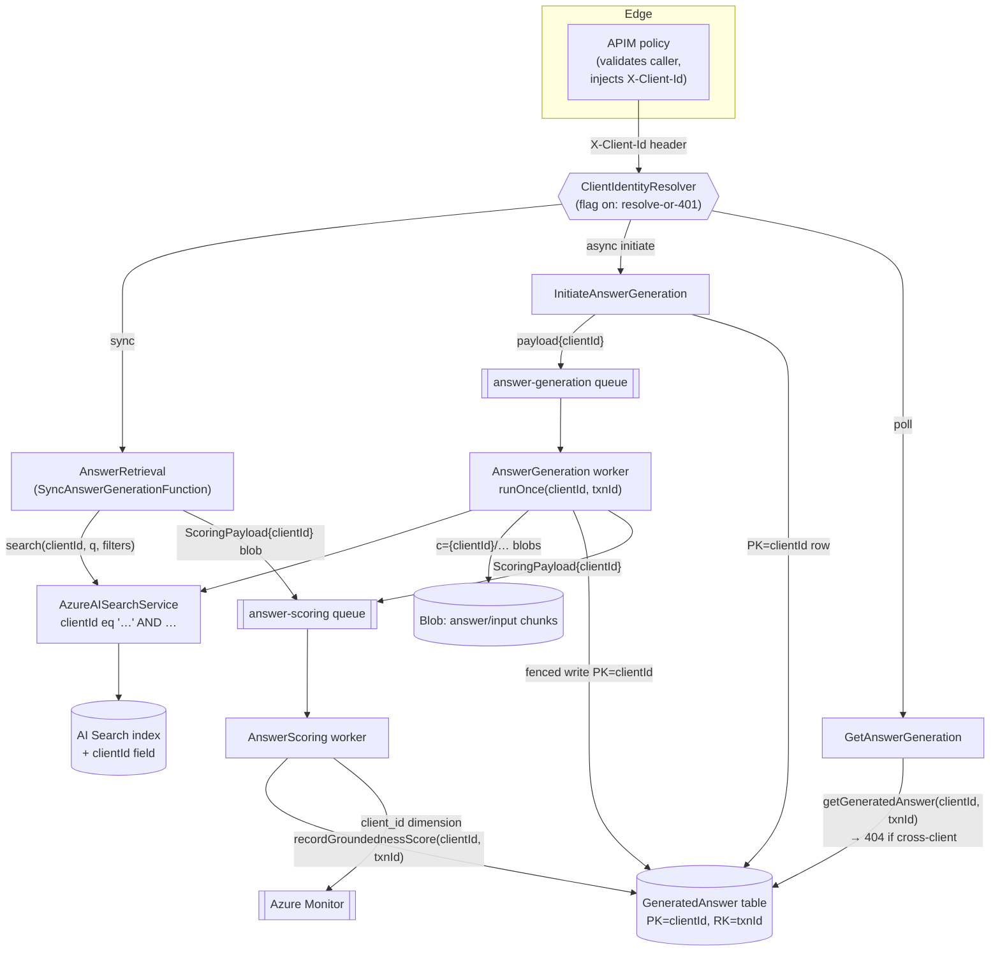
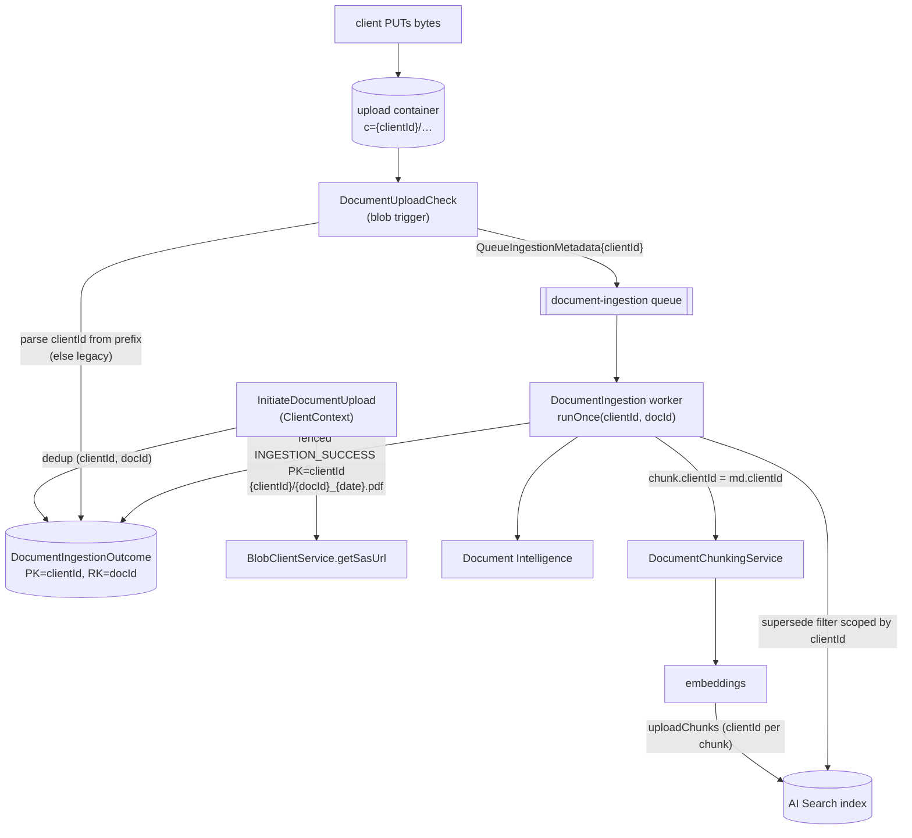

# Design: Multi-Client Data Isolation (CP AI RAG Service)

> Stage 2 artefact (architecture-designer). Naming is `clientId` throughout (D1). This document is grounded in the current code; every element cites a real class/method. It feeds story-writing and test scaffolding. Requirements: `01-requirements.md` (approved); input brief: `00-input-brief.md`.

## Summary

Introduce per-client logical isolation across the data plane (single AI Search index, single storage account, single set of tables — NFR-1) by threading one `clientId` attribute through every path: a top-level Search field + leading OData filter clause, the Table partition key, a blob path prefix, and a non-optional queue-payload field. Client identity is extracted at the HTTP edge behind **one shared abstraction** (`ClientIdentityResolver`/`ClientContext` in `ai-document-shared-artefacts`, D4), enforced behind `CLIENT_FILTERING_ENABLED` (off = today's behaviour, NFR-2). The existing production corpus is stamped with an incumbent `clientId` before enforcement using the **existing `ai-document-migration-tool`** (index→index copier + table→table copier), extended with a `clientIdOverride` on the index side analogous to the table tool's existing `partitionKeyOverride`. Cut-over is drained-queue, no dual-write (D3).

This is not a new function or endpoint — it is a **cross-cutting extension of five existing functions, the shared artefacts module, and the migration tool**. No consumer OpenAPI contract change (NFR-7/D5).

---

## Verified code baseline (what the design must fit)

| Concern | Real code today | Change vector |
|---|---|---|
| HTTP entry points | `DocumentUploadFunction` (`InitiateDocumentUpload`), `DocumentStatusByReferenceFunction`, `SyncAnswerGenerationFunction` (`AnswerRetrieval`), `InitiateAnswerGenerationFunction`, `GetAnswerGenerationResultFunction` — all `authLevel = FUNCTION`, no caller identity | Adopt `ClientIdentityResolver` uniformly |
| Search filter | `AzureAISearchService.generateFilterExpression(List<KeyValuePair>)` builds `customMetadata/any(...)` + `IS_ACTIVE_FILTER`; `escapeODataStringLiteral` already exists (`StringUtil`) | Prepend leading `clientId eq '…'`; add `clientId` param |
| Index schema | `vector-db-index-schema-v2.json`; no client field; chunk `id` = random UUID (`DocumentChunkingService.createChunkedEntry`) | Add filterable, non-searchable `clientId` field |
| Chunk model | `ChunkedEntry` record; written by `DocumentStorageService.uploadChunks`, read by `AzureAISearchService.getColumnsToRetrieve` | Add `clientId` field + `IndexConstants.CLIENT_ID` |
| Table keying | `DocumentIngestionOutcomeTableService` / `AnswerGenerationTableService` build `new TableEntity(key, key)` everywhere (`insert`, `claimLease`, `createClaimedRow`, `readForClaim` via `getFirstDocumentMatching(key,key)`, `recordOutcomeFenced`, `upsertTerminalFenced`, `recordGroundednessScore`) | PK=clientId, RK=key; client-aware `IdempotencyStatusStore` |
| Idempotency | `IdempotencyGuard.runOnce(String key, work)`; `ClaimToken(key, etag)`; lease cols `TC_LEASE_OWNER`/`TC_LEASE_EXPIRES_AT` | `runOnce(clientId, key, work)`; `ClaimToken(clientId, key, etag)` |
| Blob naming | `DocumentBlobNameResolver` regex `^([^_]+)_([0-9]{8})\.[^.]+$`; answer blobs via `ChunkUtil.getAnswerWithChunksFilename/getInputChunksFilename`; `BlobClientService.getSasUrl` (user-delegation SAS, managed identity) | `c={clientId}/` prefix + dual-path parse |
| Queues | `QueueIngestionMetadata` (`@JsonIgnoreProperties(ignoreUnknown=true)`), `AnswerGenerationQueuePayload`, `ScoringQueuePayload` (filename-only), `ScoringPayload` | Add `clientId` to first two + `ScoringPayload` |
| Scoring/telemetry | `AnswerScoringFunction` reads `ScoringPayload` blob, `PublishScoreService.publishGroundednessScore(score, userQuery)` → `AzureMonitorService.publishHistogramScore(...,"query_type", userQuery)` (single dimension) | `client_id` dimension; write score back to `(clientId, transactionId)` |
| Dedup / supersede | `DocumentUploadService.isDocumentAlreadyProcessed(documentId)`; `DocumentStorageService.getSearchResults` filter on `customMetadata` documentId | Scope both to `(clientId, documentId)` |
| Migration | `IndexCopier` copies `ChunkedEntry` verbatim; `TableCopier` already supports `partitionKeyOverride`; `IndexMigrationTool`/`TableMigrationTool` arg parsing | Add `clientIdOverride` to index tool |

**Environment signal on migration state:** the `ai-service-orchestration-test/.env.sample` and `ai-document-system-prompt-harness-eval/.env.sample` both set `AZURE_SEARCH_SERVICE_INDEX_NAME=ai-rag-service-index` (the raw v1 index name, not an alias), and the two function `local.settings.sample.json` files use placeholders. **Assumption (state explicitly):** the v2 rebuild + alias cutover has **not yet been executed** in the deployed environments — the v2 schema and migration tool exist but config still points at the plain index. This drives decision **DD-4** below (fold the `clientId` field into the pending single v2 rebuild rather than adding a v3). If any environment has already cut over to v2, the fallback (in-place field add via the management API) applies — see §B.

---

## Pattern & Rationale

This spans several buckets simultaneously — it is not one new trigger but a **cross-cutting capability threaded through existing modules**:

- **Reusable identity abstraction across functions → add to `ai-document-shared-artefacts`**. This is the FR-1 single point of change.
- **HTTP surface:** none. The client-identity header is an **internal APIM↔function contract**, deliberately kept out of the consumer spec (D5/NFR-7). So this is explicitly **not** a `POST /answer-user-query` shape change.
- **Existing-function extension** for the five HTTP functions, two queue workers, and the scorer.
- **Migration** stays in the existing not-deployed `ai-document-migration-tool`.

**Sync vs async:** unchanged. Both `SyncAnswerGenerationFunction` (`AnswerRetrieval`) and the async trio (`InitiateAnswerGeneration` → `AnswerGeneration` worker → `GetAnswerGeneration`) already exist; we thread `clientId` through both without altering the sync/async split.

**Rejected shape — new "isolation gateway" function or per-request lookup service:** rejected. Identity is a header set by APIM; a dedicated function would add a hop, a failure mode, and latency for what is a boundary parse + validate. The shared resolver called in-process is simpler and matches D4's "single point of change."

**Rejected shape — index-per-client / storage silo:** rejected per NFR-1 (zero new infra). Logical isolation with `clientId` as a namespace keeps the door open (Confluence retained design point) to route a specific client to its own index later via config only.

---

## Contract Impact

**Internal only — no consumer contract change.** `api-cp-ai-rag` (`ai-rag-service.openapi.yml`) is **unchanged** (NFR-7, D5). The client-identity header is an APIM↔function-app internal contract and must not appear in the spec. Confirm via the `api-contract-check` skill that no `operationId` request/response schema changes (`initiate-document-upload`, `document-status-by-reference`, `answer-user-query`, `answer-user-query-async`, `answer-user-query-status`).

- The new **401** on missing/invalid identity (FR-2) is an enforcement behaviour behind a flag; it is not a documented success/error schema change to a request body. The existing `requestErrored` 400/500 shapes are untouched. If the spec team wants 401 documented as a possible response for completeness, that is a **spec-repo-first** follow-up, but it is not required to ship (the header is invisible to the documented consumer, who always sends it via APIM).
- The `clientId` value **never appears in any request/response body** — it rides the header inbound and internal storage/queues thereafter. `documentUploadRequest.metadataFilter[]` and `answerUserQueryRequest` are unchanged; a caller cannot set `clientId` through them (AC-3).

---

## A. Client-identity abstraction (`ai-document-shared-artefacts`)

New package `uk.gov.moj.cp.ai.client.identity` (sibling to `uk.gov.moj.cp.ai.idempotency`).

```java
// The single point of change when AMP finalises the mechanism (D4/FR-1).
public interface ClientIdentityResolver {
    /**
     * @return ClientContext carrying the validated clientId (enforcement on) or an
     *         empty, unenforced context (flag off).
     * @throws ClientIdentityException  enforcement on AND identity missing/blank/malformed → maps to 401
     */
    ClientContext resolve(HttpRequestMessage<?> request);
}
```

```java
public final class ClientContext {
    private final String clientId;   // null when unenforced & absent
    private final boolean enforced;

    public static ClientContext unenforced()              { ... } // flag off
    public static ClientContext of(String clientId)       { ... } // flag on, resolved
    public Optional<String> clientId()                    { return Optional.ofNullable(clientId); }
    public boolean enforced()                             { return enforced; }
}
```

```java
public final class HeaderClientIdentityResolver implements ClientIdentityResolver {
    // Header name is configurable so AMP can switch to JWT/cookie extraction without a code change (D4).
    private final String headerName;   // CLIENT_IDENTITY_HEADER, default "X-Client-Id"
    private final boolean enforced;     // CLIENT_FILTERING_ENABLED (FR-3)

    @Override public ClientContext resolve(HttpRequestMessage<?> request) {
        final String raw = request.getHeaders().get(headerName.toLowerCase()); // Functions lower-cases header keys
        if (!enforced) {
            return ClientContext.unenforced();                 // AC-4: flag off → identity optional
        }
        if (isNullOrEmpty(raw) || !UuidUtil.isValid(raw)) {    // NFR-4: UUID validated at the boundary (D7)
            throw new ClientIdentityException("Missing or invalid client identity");
        }
        return ClientContext.of(raw);                          // AC-1
    }
}
```

- **Flag semantics (FR-3):** off → `Optional.empty()` tolerated everywhere (no filter clause, legacy keying/tables); on → resolve-or-401.
- **UUID validation (NFR-4/D7):** reuse `UuidUtil.isValid` (already used by `DocumentStatusByReferenceFunction` and `GetAnswerGenerationResultFunction`). Because `clientId` lands in an OData literal, a Table partition key, a blob path segment and a metric dimension, validating the UUID shape at ingress makes all four downstream uses safe by construction. (`escapeODataStringLiteral` still applies belt-and-braces in the filter — DD-3.)
- **Spoof resistance (AC-3):** identity is read only from the header; request body / `metadataFilter` are never consulted.
- **Adoption in the 5 HTTP functions** — one uniform pattern at the top of each `run(...)`, mapping `ClientIdentityException` → **401** via a shared helper (e.g. `HttpResponses.unauthorized(request)`), reusing each function's existing `generateResponse`:

```java
final ClientContext ctx;
try { ctx = clientIdentityResolver.resolve(request); }
catch (ClientIdentityException e) { return unauthorized(request); }   // FR-2 / AC-2
```

  Then `ctx.clientId()` is threaded into the service calls below. `InitiateDocumentUpload` and `InitiateAnswerGeneration` copy it onto the queue payload; the two GET functions use it as the Table partition key (→ 404 on cross-client, FR-14); `AnswerRetrieval` threads it into `search(...)` and the `ScoringPayload`.

- **Queue workers have no header.** They recover `clientId` from the queue payload (FR-7/FR-11) and pass it through a small validation guard `ClientId.requireValid(String)` (same `UuidUtil` check) before use. The single *HTTP* abstraction is FR-1; workers trust the payload value that was validated at ingress and re-validate defensively.

---

## B. AI Search — where `clientId` lands

**Decision (DD-4): add a top-level `clientId` field to `vector-db-index-schema-v2.json` and fold it into the single pending v2 rebuild** (`filterable: true, searchable: false, retrievable: true, stored: true, sortable: false, facetable: false`), sitting beside `documentId`. Field-level detail mirrors `documentId`'s v2 row in `SCHEMA_CHANGES.md`.

Rationale, weighing the three options against the migration reality:

- **(i) add to `vector-db-index-schema-v2.json` before the v2 run — CHOSEN.** The environment signal (config still points at `ai-rag-service-index`) indicates the v2 rebuild has not yet run. Adding `clientId` to that schema means the *single* index rebuild does triple duty: v2 attribute correction + `clientId` field creation + incumbent stamping (via the copier `clientIdOverride`, §F). One full sharded pass, no second rebuild. This is exactly what amended FR-4 directs.
- **(ii) a v3 schema — REJECTED.** Only warranted if v2 has already been cut over. It forces a *second* ~340k-vector rebuild for no attribute benefit. If a given environment turns out to already be on v2, use the fallback below rather than a v3.
- **(iii) in-place nullable-field add via the management API — REJECTED as the primary path, RETAINED as the fallback.** Adding a *new* field is one of the few schema mutations Azure AI Search permits in place (it is existing-field *attribute* changes that are immutable — the whole premise of `SCHEMA_CHANGES.md`). So for any environment already on v2, add `clientId` in place, then run a targeted stamping pass to backfill. But where v2 hasn't run, in-place add still leaves the full backfill to do and needs its own vehicle — the copier is the proven one — so folding into the rebuild is strictly simpler.

**Assumption to confirm at cut-over:** per environment, check whether `AZURE_SEARCH_SERVICE_INDEX_NAME` already resolves to a v2 alias. If not (expected) → path (i). If yes → path (iii) fallback.

**Code changes:**
- `IndexConstants`: add `public static final String CLIENT_ID = "clientId";`
- `ChunkedEntry`: add `@JsonProperty(CLIENT_ID) String clientId` + builder `.clientId(...)`. Additive to the record; JSON stays backward-compatible for legacy blobs/messages (null when absent).
- `AzureAISearchService.generateFilterExpression(String clientId, List<KeyValuePair> metadataFilters)` — prepend, when `clientId` present (enforcement on), a **non-optional leading clause** ANDed with the rest (FR-5, AC-5):

```java
if (!isNullOrEmpty(clientId)) {
    filterBuilder.append(format("%s eq '%s'", IndexConstants.CLIENT_ID, escapeODataStringLiteral(clientId)));
    // then " and " before the customMetadata clauses / IS_ACTIVE_FILTER
}
```
  `search(...)` gains a `clientId` parameter threaded from `SyncAnswerGenerationFunction` and `AnswerGenerationFunction`. When `clientId` is empty (flag off) the expression is byte-for-byte today's output (AC-4). Escaping via existing `escapeODataStringLiteral` (DD-3).
- `getColumnsToRetrieve()`: add `IndexConstants.CLIENT_ID` so the field round-trips into `ChunkedEntry` (needed for the scoring payload and telemetry dimension).
- Ingestion write: `DocumentStorageService.uploadChunks` adds `searchDocument.put(CLIENT_ID, chunkedEntry.clientId())`. `DocumentChunkingService.createChunkedEntry` sets `.clientId(queueMetadata.clientId())` (threaded from `QueueIngestionMetadata`, §E). Chunk `id` stays a random UUID → no cross-client key collision (assumption confirmed).
- Supersede/deletion scoping (FR-8): `DocumentStorageService.getSearchResults` filter must be scoped — prepend `clientId eq '<clientId>' and (…)` so client A cannot mark client B's chunks inactive. Thread `clientId` from the orchestrator (recovered from `QueueIngestionMetadata`).

**Count-variable invariant** (`SEARCH_NEAREST_NEIGHBOURS_COUNT ≥ SEARCH_TOP_RESULTS_COUNT > SEARCH_MMR_FINAL_COUNT`) is unaffected — the clientId clause only narrows the candidate set, exactly as a metadataFilter does today. The MMR/dedup pipeline order is untouched.

---

## C. Table Storage — re-keying & client-aware idempotency

**Keying (FR-6):** `DocumentIngestionOutcome` → PK=`clientId`, RK=`documentId`; `GeneratedAnswer` → PK=`clientId`, RK=`transactionId`; `clientId` also stored as a non-key column (`TC_CLIENT_ID`) for readability/telemetry. When enforcement is **off**, the effective partition key falls back to the row key (today's PK==RK==key) so legacy rows resolve unchanged (NFR-2).

**New tables vs in-place — DD-5: new tables via the existing `TableCopier`.** A Table `PartitionKey` is immutable (the copier README states exactly this), so re-keying is a copy-into-new-table. The existing `TableCopier` with `partitionKeyOverride=<incumbent clientId>` already does this, non-destructively and idempotently. The app repoints `STORAGE_ACCOUNT_TABLE_DOCUMENT_INGESTION_OUTCOME` / `STORAGE_ACCOUNT_TABLE_ANSWER_GENERATION` to the new table names at cut-over. **No new infra** — same account, new tables (NFR-1 allows tables within the retained account; "single set of tables retained" means one logical set post-migration, the old ones are decommissioned after the reversibility window).

**Client-aware `IdempotencyStatusStore` (FR-7)** — the full interface change (keyed on `(clientId, key)`; a null/blank clientId means legacy PK==RK==key):

```java
public interface IdempotencyStatusStore {
    LeaseSnapshot readForClaim(String clientId, String key) throws EntityRetrievalException;
    boolean isTerminal(String status);
    String  claimLease(String clientId, String key, String expectedEtag, String owner, OffsetDateTime expiresAt);
    String  createClaimedRow(String clientId, String key, String owner, OffsetDateTime expiresAt) throws DuplicateRecordException;
    void    releaseLease(String clientId, String key, String etag);
}
```

Both implementations compute `partitionKey = isNullOrEmpty(clientId) ? key : clientId` and replace every `new TableEntity(key, key)` / `getFirstDocumentMatching(key, key)` with `new TableEntity(partitionKey, key)` / `getFirstDocumentMatching(partitionKey, key)`. The fenced terminal writers gain `clientId`:
- `DocumentIngestionOutcomeTableService`: `insert(clientId, …)`, `upsertDocument(clientId, …)`, `recordOutcomeFenced(clientId, documentId, …)`, `getDocumentById(clientId, documentId)`.
- `AnswerGenerationTableService`: `saveAnswerGenerationRequest(clientId, …)`, `upsertTerminalFenced(clientId, …)`, `getGeneratedAnswer(clientId, transactionId)`, `recordGroundednessScore(clientId, transactionId, score)`.

**`IdempotencyGuard`** (FR-7, NFR-6):
```java
public GuardOutcome runOnce(String clientId, String key, IdempotentWork work) throws Exception
```
`claim(...)` threads `clientId` into all store calls. **`ClaimToken` gains `clientId`** (`record ClaimToken(String clientId, String key, String etag)`) so the fenced terminal write in the workers (`upsertTerminalFenced`, `recordOutcomeFenced`) targets the correct partition. All lease semantics — ETag fencing, `LEASE_RELEASED` on release, terminal-skip, live-lease rethrow-vs-WARN, the lease-TTL invariant `IDEMPOTENCY_LEASE_TTL_SECONDS < visibilityTimeout × (maxDequeueCount − 1)` — are preserved verbatim; only the key is now two-part (NFR-6, AC-8).

**Worker call-site changes** (recover `clientId` from the payload *before* claiming — FR-7):
- `DocumentIngestionFunction`: `idempotencyGuard.runOnce(md.clientId(), documentId, token -> processUnderClaim(...))`; `processQueueMessageFailedIfSafe` and `DocumentIngestionOrchestrator` (`recordOutcome`, `processQueueMessageFailed`) all take `clientId`.
- `AnswerGenerationFunction`: `runOnce(payload.clientId(), transactionId.toString(), …)`; `recordAnswerGenerationFailed`, `recordAnswerGenerationFailedIfSafe`, `upsertTerminalFenced` all take `clientId` (available from `payload.clientId()` / `token.clientId()`).

**`DocumentUploadFunction` dedup (FR-8, AC-7):** `DocumentUploadService.isDocumentAlreadyProcessed(clientId, documentId)` → `getDocumentById(clientId, documentId)`. Two clients with the same `documentId` land under different partition keys and coexist; dedup, overwrite (`supersededDocuments`) and chunk-deletion are all client-scoped.

**404 semantics (FR-14, AC-14, NFR-3):** `DocumentStatusByReferenceFunction` and `GetAnswerGenerationResultFunction` look up `getDocumentById(ctx.clientId(), documentReference)` / `getGeneratedAnswer(ctx.clientId(), transactionId)`. A row owned by another client lives under a different partition key, so the lookup returns not-found → existing **404** path. No 403, no existence signal — the isolation is a natural consequence of partition scoping, not a special check.

**Rows created while the flag is off:** they live in the *old* tables keyed PK==RK==key. Because keying, table names, alias and flag all flip **together** at cut-over and **queues are drained first (D3)**, there is never a moment where a write lands in the wrong-keyed table mid-flight. The `TableCopier` is re-run as the final pre-flip step (idempotent) to catch any rows written after the initial copy (see §F runbook).

---

## D. Blob strategy

**Prefix (FR-9):** new document blobs at `c={clientId}/{documentId}_{yyyyMMdd}.{ext}`; answer-payload blobs at `c={clientId}/llm-answer-with-chunks-{transactionId}.json` and `c={clientId}/llm-input-chunks-{transactionId}.json`. The `c=` segment is a virtual directory — `BlobClientService.getSasUrl` and `getBlobClient` handle `/`-containing names without change.

**`DocumentBlobNameResolver` dual-path (FR-10, NFR-5):**
```java
public String getBlobName(String clientId, String documentId, String ext) {
    final String flat = format("%s_%s.%s", documentId, today(), ext);
    return isNullOrEmpty(clientId) ? flat : format("c=%s/%s", clientId, flat);   // flag off → legacy flat
}
```
`getDocumentId(String blobName)` matches both shapes; add a second pattern `^c=([^/]+)/([^_]+)_([0-9]{8})\.[^.]+$` and expose `getClientId(blobName)` returning the prefix's clientId or `null` for legacy flat blobs. The existing flat `BLOB_PATTERN` is retained (AC-10, NFR-5).

**Blob trigger (`DocumentBlobTriggerFunction`):** parse `clientId` from the prefix when present, else treat as legacy (null → incumbent-owned). Look up the Table row by `(clientId, documentId)` and thread `clientId` onto the `QueueIngestionMetadata`. The **Table row is authoritative** for ownership — the path is a convenience, not the source of truth.

**`DocumentUploadFunction`:** builds the blob name via `documentBlobNameResolver.getBlobName(ctx.clientId().orElse(null), documentId, ext)` and SAS as today.

**Answer/scoring blobs:** `ChunkUtil.getAnswerWithChunksFilename(clientId, transactionId)` / `getInputChunksFilename(clientId, transactionId)` prepend the prefix. `GetAnswerGenerationResultFunction` reads the input-chunks blob using `ctx.clientId()`. The **scoring read path needs no change** — `ScoringQueuePayload.filename` already carries the *full* path the producer wrote, so the scorer's `blobService.readBlob(queuePayload.filename(), …)` resolves the prefixed path transparently.

**Legacy blobs stay in place** (out of scope: physical migration / resolver retirement). Flag-off retrieval of a flat-named blob is unchanged (NFR-5).

---

## E. Queue & scoring threading

- `QueueIngestionMetadata` gains `String clientId` (kept last; `@JsonIgnoreProperties(ignoreUnknown=true)` already makes deserialization tolerant, so drained-then-new messages are safe — though D3 means none are in flight). `DocumentBlobTriggerFunction.createQueueMessage` sets it.
- `AnswerGenerationQueuePayload` gains `String clientId`. `InitiateAnswerGenerationFunction` sets `ctx.clientId()`. It survives redelivery because it is a payload field, so the async / citation-guard retry path (maxDequeueCount 3, lease released before rethrow) re-reads it on every attempt (FR-11, AC-11).
- **Scoring (FR-12, AC-12):** `ScoringQueuePayload` stays **filename-only** (unchanged). `clientId` rides the `ScoringPayload` blob — add `String clientId` to `ScoringPayload`. Producers (`AnswerGenerationFunction.saveLlmResponseToTheBlobContainer`, `SyncAnswerGenerationFunction`) set it. `AnswerScoringFunction` reads `scoringPayload.clientId()` and writes the score back via `answerGenerationTableService.recordGroundednessScore(scoringPayload.clientId(), scoringPayload.transactionId(), score)`. (Sync path's `ScoringPayload` has `transactionId=null` today → no table write; unchanged, still valid.)
- **Telemetry (FR-13, AC-13):** `PublishScoreService.publishGroundednessScore(BigDecimal score, String userQuery, String clientId)`; `AzureMonitorService.publishHistogramScore(...)` extended to accept multiple attributes (use `Attributes.builder().put("query_type", userQuery).put("client_id", clientId).build()`), adding a `client_id` dimension for per-client groundedness segmentation. Independent of the separate `query_type` PII concern (out of scope).

---

## Diagrams

### 1. Request flow (sync + async) with clientId threading



### 2. Ingestion flow



### 3. Migration / cut-over sequence (per environment)

```mermaid
sequenceDiagram
    participant Op as Release operator
    participant App as Function app
    participant Q as Queues
    participant Idx as AI Search
    participant Tbl as Tables
    Op->>App: Deploy code (CLIENT_FILTERING_ENABLED=false, tables=old, index=current)
    Op->>App: Quiesce write traffic (pause uploads / answer generation)
    Op->>Q: Drain ingestion + answer-generation + scoring queues (D3)
    Note over Q: no in-flight messages, no live idempotency leases
    Op->>Idx: migration-tool index … clientIdOverride=<incumbent> (build v2, stamp clientId)
    Op->>Tbl: migration-tool table <src> <new> <incumbent> (both tables)
    Op->>Tbl: (final idempotent re-run of table copy just before flip)
    Op->>Idx: az rest — repoint alias to v2
    Op->>App: set AZURE_SEARCH_SERVICE_INDEX_NAME=alias
    Op->>App: repoint STORAGE_ACCOUNT_TABLE_* to new tables
    Op->>App: CLIENT_FILTERING_ENABLED=true (enforcement on)
    Op->>App: Resume traffic
    Note over Op,App: Rollback = flip flag off + repoint tables to old (+ alias to v1); no data rewrite
```

---

## F. Migration & cut-over

**Extensions to `ai-document-migration-tool`:**
- **Index copier — add `clientIdOverride`** (the index-side analogue of `TableCopier`'s existing `partitionKeyOverride`). `IndexMigrationTool` gains a positional/optional `clientIdOverride` arg (blank/`-` = copy verbatim, as the table tool does for maxRecords). `IndexCopier.uploadPage` maps each `ChunkedEntry` to a copy with `.clientId(override)` set before handing to the `DocumentUploader`. Because the copier reads via `result.getDocument(ChunkedEntry.class)` and uploads `ChunkedEntry`, the only prerequisites are (1) `clientId` on `ChunkedEntry` and (2) the `clientId` field on `vector-db-index-schema-v2.json` (§B). Uploads stay idempotent upserts keyed by `id`; re-runs are safe.
- **Table copier — no change needed.** It already rewrites `PartitionKey` to a fixed value and copies data columns verbatim. Run it twice, once per table, with `partitionKeyOverride=<incumbent clientId>`. Because queues are drained (D3) there are **no live leases** at migration time, so the FR-15 "skip rows under live leases" concern does not arise — all rows are terminal or non-terminal-but-quiescent and copy safely (stale `LeaseExpiresAt`/`LeaseOwner` columns copy harmlessly; an expired/released lease in the new table is reclaimable). *Optional belt-and-braces:* a `--terminal-only` filter, but not required given D3.

**Per-environment runbook** (see diagram 3): deploy (flag off) → quiesce writes → **drain queues** → index copy+stamp (v2) → table copy+rekey (×2) → final idempotent table re-copy → repoint alias → repoint table env vars → **flip flag on** → resume → onboard further clients via APIM config only.

**Alias ↔ flag interaction:** the alias repoint and the `CLIENT_FILTERING_ENABLED` flip are **independent levers**. v2 works with the flag off (the `clientId` field is simply unused, and `generateFilterExpression` omits the clause). So the alias can move to v2 ahead of enforcement. The **true reversible levers are the flag + the table-name env vars**: flip flag off and repoint tables back to the (untouched) old tables and the service is exactly as before — **no data rewrite** (NFR-2). The alias can safely stay on v2 during rollback (superset data; flag-off ignores `clientId`). **OQ-4** (incumbent `clientId` value) is supplied as the migration-tool argument, not an app env var.

---

## G. OQ-2 recommendation — `metadataFilter` allow-list (FR-17)

**Recommend: general allow-list OUT of scope this iteration; add a cheap reserved-key rejection instead.**

Rationale grounded in the code: `clientId` is a **top-level** Search field, whereas `metadataFilter` entries are compiled by `generateFilterExpression` into `customMetadata/any(m: m/key eq '…')` clauses. A caller putting `key=clientId` in `metadataFilter` produces a `customMetadata/any(...)` clause that can **never** match the top-level `clientId` field — so it cannot weaken the mandatory leading `clientId eq '…'` clause. Isolation does **not** depend on the allow-list. A full product-facing allow-list needs its own spec/product discussion and risks breaking legitimate metadata keys. **Minimal hardening to include now:** reject `metadataFilter` keys in a small reserved set (`clientId`, `is_active`) with 400 at the HTTP boundary — defence-in-depth against confusion/log-noise, one guard, no contract change. **Stakeholder decision (2026-07-20): the rejection is always-on — NOT gated by `CLIENT_FILTERING_ENABLED`** (defence-in-depth applies pre-cutover too; these keys are internal and no legitimate caller uses them today). Track the general allow-list as a separate follow-up.

## H. OQ-3 recommendation — eval harness (FR-18)

**Resolved (stakeholder decision, 2026-07-23): the harness stays client-unscoped — no changes to `ai-document-system-prompt-harness-eval` at all.** This supersedes the original recommendation below.

The harness exists to evaluate **prompt and model quality** (system/user prompts × LLMs × queries → citation/verbosity/coverage metrics), not data isolation. It keeps calling `search(null, …)`: a null clientId generates no filter clause and never references the `clientId` column (the conditional column-select), so the harness works unchanged against both the current v1 index and the migrated v2 index — parity with today's behaviour is exact, before and after cut-over. Isolation proof is the integration suite's job (MTDI-08), not the harness's.

*Accepted trade-off:* post-cutover the unscoped harness sees the whole corpus across clients. In particular, once two clients ingest the **same** `documentId` (uniqueness is per-client), a harness run filtering on that `documentId` retrieves both clients' copies. Acceptable for an offline, operator-run eval tool; revisit only if multi-client corpora start distorting eval metrics.

<details><summary>Original (superseded) recommendation — EVAL_CLIENT_ID threading</summary>

`ai-document-system-prompt-harness-eval` runs the embed→search→generate→cite pipeline directly against `AzureAISearchService` (not via HTTP), and its `.env.sample` already sets `AZURE_SEARCH_SERVICE_INDEX_NAME`. Simplest: add `EVAL_CLIENT_ID` (set to the incumbent clientId the corpus is stamped with) and `CLIENT_FILTERING_ENABLED=true` to the harness `.env`, and pass `EVAL_CLIENT_ID` into the `search(clientId, …)` call. This exercises the **real filtered path**, so eval metrics reflect production.
- *Alternative — run the harness with the flag off (no filter):* rejected — eval would no longer mirror prod behaviour once enforcement is on.
- *Alternative — dedicated eval client with its own corpus:* rejected as heavier and unnecessary; the incumbent-stamped corpus is exactly what prod queries.

</details>

---

## Reliability

- **Idempotency key** becomes `(clientId, key)`; `IdempotencyGuard.runOnce(clientId, key, work)`, `ClaimToken(clientId, key, etag)`. Terminal-skip statuses unchanged (`INGESTION_SUCCESS/INGESTION_FAILED/FILE_SIZE_OVER_LIMIT`, `ANSWER_GENERATED/ANSWER_GENERATION_FAILED`).
- **Redelivery:** `clientId` is a payload field, so it is present on every one of the maxDequeueCount (3) attempts, including citation-guard retries (AC-11). The lease-release-before-rethrow contract (`RedeliveryException` / `DocumentProcessingException`) is unchanged.
- **Lease-TTL invariant** `IDEMPOTENCY_LEASE_TTL_SECONDS < visibilityTimeout × (maxDequeueCount − 1)` is unchanged — keying does not affect timing.
- **Fencing:** the fenced terminal writes (`recordOutcomeFenced`, `upsertTerminalFenced`) now target PK=clientId; the ETag semantics and 412→`EtagMismatchException` handling are identical (NFR-6, AC-8).
- **Poison/exhaustion:** the WARN-and-leave-non-terminal behaviour on a live lease at exhaustion is preserved (now scoped per client partition).

---

## Cross-cutting

- **Auth (managed identity):** no new credential path. `DefaultAzureCredential` unchanged for Search/Table/Blob. Client identity is an APIM-injected header, trusted because backends only accept APIM traffic (function key + network restriction). No connection strings/SAS/keys added.
- **New env vars** (document in each module's `Azure/local.settings.sample.json` **and** root `CLAUDE.md`):
  - `CLIENT_FILTERING_ENABLED` (default `false`) — enforcement flag (FR-3), all five HTTP functions + both workers + retrieval + scoring.
  - `CLIENT_IDENTITY_HEADER` (default `X-Client-Id`) — internal header name, HTTP functions only (D4 single point of change).
  - ~~`EVAL_CLIENT_ID`~~ — dropped (OQ-3 resolved 2026-07-23: harness stays client-unscoped, see §H).
  - No new **infra** env vars: the new table names reuse `STORAGE_ACCOUNT_TABLE_*` (repointed at cut-over); the alias reuses `AZURE_SEARCH_SERVICE_INDEX_NAME`; incumbent clientId is a migration-tool argument (OQ-4).
- **Validation:** UUID at the HTTP boundary (`UuidUtil.isValid`, NFR-4/D7); OData escaping via existing `escapeODataStringLiteral` (DD-3); worker-side `ClientId.requireValid` on payload values; blob-name parse validated by `DocumentBlobNameResolver`.
- **Logging (`context.getLogger()`/slf4j):** `clientId` (a UUID, non-PII) may be logged for traceability; never log the raw header alongside request bodies. No new PII surface.

---

## Risks & Trade-offs

| # | Risk | Likelihood/Impact | Mitigation |
|---|---|---|---|
| 1 | **Broad, mechanical fan-out** of the `(clientId, key)` signature change across `IdempotencyStatusStore`, both table services, `IdempotencyGuard`, `ClaimToken`, both workers, orchestrator — easy to miss a call site and break fencing (NFR-6) | Med / High | Keep the null-clientId→legacy-keying fallback so flag-off tests pass unchanged; exhaustive unit coverage on both stores; AC-8 idempotency regression test under client-aware keys |
| 2 | **Cut-over ordering error** — flipping the flag before repointing tables/alias, or before the final table re-copy, silently drops rows written during the window | Med / High | The drained-queue rule (D3) plus "quiesce writes → drain → migrate → final idempotent re-copy → repoint → flip" runbook; table copy is idempotent so re-run just before flip |
| 3 | **Environment already on v2** invalidates the "fold into v2 rebuild" assumption (DD-4) | Low / Med | Per-env check of `AZURE_SEARCH_SERVICE_INDEX_NAME` at cut-over; fallback = in-place field add (management API) + stamping pass (§B option iii) |
| 4 | **APIM header contract not yet concrete** (AMP owns it) — header name/shape may change | Med / Low | `HeaderClientIdentityResolver` + `CLIENT_IDENTITY_HEADER` isolate all change to one class (D4/FR-1); JWT/cookie extraction is a single-method swap |
| 5 | **Legacy flat-path blobs** mis-parsed by the dual-path resolver → retrieval regression (NFR-5) | Low / Med | Retain the existing `BLOB_PATTERN` untouched; add the prefixed pattern as a distinct branch; AC-10 test on both shapes |
| 6 | **Telemetry cardinality** — `client_id` dimension multiplies metric series | Low / Low | clientId is bounded (few onboarded clients); the existing `query_type=userQuery` dimension is a far larger cardinality concern (tracked separately) |

**Reversibility:** high for the runtime toggle (flag + table-name env vars, NFR-2 — no data rewrite). The **one-way-ish door** is the alias repoint (harmless to leave on v2) and, more importantly, the storage-key choice (`clientId` as PK): once clients depend on it, un-isolating means another migration.

---

## Design decisions

- **DD-1 — `clientId` everywhere** (D1). *Alt: `tenantId`* — rejected by stakeholder.
- **DD-2 — Identity extraction behind one shared `ClientIdentityResolver`/`ClientContext` in `ai-document-shared-artefacts`** (FR-1/D4). *Alt: per-function header parsing* — rejected: no single point of change when AMP finalises. *Alt: dedicated gateway function* — rejected: extra hop/latency for a boundary parse.
- **DD-3 — Reuse existing `escapeODataStringLiteral` + boundary UUID validation** for the `clientId eq '…'` clause; no new escaping. *Alt: parameterised OData* — not supported by the SDK filter API; the double-quote escape + UUID shape validation is sufficient (NFR-4).
- **DD-4 — Add `clientId` to `vector-db-index-schema-v2.json` and fold into the single pending v2 rebuild** (FR-4 amended). *Alt: v3 schema* — rejected (second full rebuild). *Alt: in-place add only* — retained as the already-on-v2 fallback.
- **DD-5 — Re-key tables via new tables + existing `TableCopier` `partitionKeyOverride`, repoint env vars at cut-over.** *Alt: in-place re-key* — impossible (PartitionKey immutable). *Alt: dual-write during migration* — rejected (D3 drained-queue removes the need).
- **DD-6 — Client-aware `(clientId, key)` idempotency with null-clientId legacy fallback**, preserving all lease/fence semantics (FR-7/NFR-6).
- **DD-7 — `clientId` on `ScoringPayload` blob, not `ScoringQueuePayload`** (FR-12); scorer writes score to `(clientId, transactionId)`.
- **DD-8 — Blob `c={clientId}/` prefix with dual-path resolver; Table row authoritative for ownership** (FR-9/FR-10); legacy blobs left in place.
- **DD-9 — Extend the index copier with `clientIdOverride`** (analogue of the table tool's `partitionKeyOverride`); table copier unchanged (FR-15/FR-16).
- **DD-10 — 404 (not 403) on cross-client lookup as a natural consequence of partition scoping** (FR-14/NFR-3), no special-case check.
- **DD-11 — Flag + table-name env vars are the reversible levers; alias repoint is independent** and may remain on v2 during rollback (NFR-2).
- **DD-12 — metadataFilter allow-list deferred; reserved-key rejection added, always-on (not flag-gated)** (OQ-2, stakeholder decision 2026-07-20) — isolation does not depend on it.
- **DD-13 (revised 2026-07-23) — Eval harness stays client-unscoped: no harness changes** (OQ-3, stakeholder decision — the harness evaluates prompt/model quality, not isolation; `search(null, …)` keeps exact parity against v1 and v2 indexes; see §H).

---

## Module-by-module change inventory

**`ai-document-shared-artefacts`**
- New: `uk/gov/moj/cp/ai/client/identity/{ClientIdentityResolver, HeaderClientIdentityResolver, ClientContext, ClientIdentityException, ClientId}.java`
- `index/IndexConstants.java` — add `CLIENT_ID`
- `model/ChunkedEntry.java` — add `clientId` field + builder
- `model/QueueIngestionMetadata.java` — add `clientId`
- `model/ScoringPayload.java` — add `clientId`
- `idempotency/IdempotencyStatusStore.java`, `IdempotencyGuard.java`, `ClaimToken.java` — `(clientId, key)` API
- `service/table/DocumentIngestionOutcomeTableService.java`, `AnswerGenerationTableService.java` — clientId keying + method signatures; add `TC_CLIENT_ID` to `entity/StorageTableColumns.java`
- `SharedSystemVariables.java` — add `CLIENT_FILTERING_ENABLED`, `CLIENT_IDENTITY_HEADER`
- `src/main/resources/vector-db-index-schema-v2.json` — add `clientId` field

**`ai-document-metadata-check-function`**
- `DocumentUploadFunction.java` — resolver + 401; `getBlobName(clientId, …)`; dedup `(clientId, documentId)`
- `DocumentBlobTriggerFunction.java` — parse clientId from prefix; set on `QueueIngestionMetadata`; `(clientId, documentId)` row lookup
- `utils/DocumentBlobNameResolver.java` — prefixed `getBlobName` + dual-path `getDocumentId` + `getClientId`
- `service/DocumentUploadService.java` — clientId-scoped methods
- `Azure/local.settings.sample.json`

**`ai-document-ingestion-function`**
- `DocumentIngestionFunction.java` — `runOnce(md.clientId(), documentId, …)`
- `service/DocumentIngestionOrchestrator.java` — thread clientId into `recordOutcome`, superseding, failure paths
- `service/DocumentChunkingService.java` — set `chunk.clientId`
- `service/DocumentStorageService.java` — `uploadChunks` writes `clientId`; `getSearchResults` filter scoped by clientId
- `Azure/local.settings.sample.json`

**`ai-document-answer-retrieval-function`**
- `SyncAnswerGenerationFunction.java` (`AnswerRetrieval`) — resolver + 401; `search(clientId, …)`; clientId into `ScoringPayload`
- `InitiateAnswerGenerationFunction.java` — resolver + 401; clientId onto `AnswerGenerationQueuePayload` + pending row
- `AnswerGenerationFunction.java` (worker) — `runOnce(payload.clientId(), …)`; clientId through fenced writes, `ScoringPayload`, failure paths
- `GetAnswerGenerationResultFunction.java` — resolver + 401; `(clientId, transactionId)` lookup → 404; clientId in input-chunks blob path
- `model/AnswerGenerationQueuePayload.java` — add `clientId`
- `service/AzureAISearchService.java` — `generateFilterExpression(clientId, …)`, `search(clientId, …)`, `getColumnsToRetrieve` + CLIENT_ID
- `util/ChunkUtil.java` — clientId-prefixed filenames
- `Azure/local.settings.sample.json`

**`ai-document-status-check-function`**
- `DocumentStatusByReferenceFunction.java` — resolver + 401; `(clientId, documentReference)` lookup → 404
- `Azure/local.settings.sample.json`

**`ai-document-answer-scoring-function`**
- `AnswerScoringFunction.java` — read `scoringPayload.clientId()`; `recordGroundednessScore(clientId, txnId, score)`
- `service/PublishScoreService.java` — clientId param
- `service/AzureMonitorService.java` — multi-attribute `publishHistogramScore` with `client_id`

**`ai-document-migration-tool`**
- `index/IndexMigrationTool.java` — parse `clientIdOverride` arg
- `index/IndexCopier.java` (and `uploadPage`) — stamp `ChunkedEntry.clientId` when override set
- README/SCHEMA_CHANGES doc updates

**`ai-document-system-prompt-harness-eval`** — **no changes** (DD-13 revised: harness stays client-unscoped, `search(null, …)`).

**`ai-service-orchestration-test`** — `x-client-id`/`X-Client-Id` header on all request helpers; second-client fixture; new tests (cross-client 404, filter clause, header 401, spoof override).

**Root `CLAUDE.md`** — env-var section: `CLIENT_FILTERING_ENABLED`, `CLIENT_IDENTITY_HEADER`; module table gains `ai-document-migration-tool`.

---

## Phased implementation outline (feeds story-writer)

**Phase 0 — Shared foundations (merge safely, flag off, no behaviour change)**
- Add `ClientIdentityResolver`/`HeaderClientIdentityResolver`/`ClientContext`/`ClientIdentityException`/`ClientId` + `CLIENT_FILTERING_ENABLED`/`CLIENT_IDENTITY_HEADER` (default off → `unenforced()`; AC-4).
- Add `IndexConstants.CLIENT_ID`, `ChunkedEntry.clientId`, `TC_CLIENT_ID`, `clientId` on `QueueIngestionMetadata`/`AnswerGenerationQueuePayload`/`ScoringPayload` (all additive/nullable).
- Add `clientId` field to `vector-db-index-schema-v2.json`.

**Phase 1 — Client-aware storage (flag-gated behaviour; legacy path preserved)**
- Client-aware `IdempotencyStatusStore`/`IdempotencyGuard`/`ClaimToken`; null-clientId→legacy keying; AC-8 regression.
- Client-scoped table service methods; `DocumentUploadService` dedup `(clientId, documentId)`; AC-7.
- `generateFilterExpression(clientId, …)` + `search(clientId, …)`; AC-5/AC-6.
- Blob prefix + dual-path resolver; AC-9/AC-10.

**Phase 2 — Wire the five functions + workers + scorer to the resolver (flag on = enforcement)**
- Resolver+401 in all five HTTP functions (FR-2/AC-1/AC-2/AC-3); 404 in the two GETs (AC-14).
- clientId threaded onto both queue payloads + `ScoringPayload`; workers `runOnce(clientId, …)`; AC-11/AC-12.
- Telemetry `client_id` dimension; AC-13.
- Reserved-key rejection (OQ-2 minimal).

**Phase 3 — Migration tooling & harness**
- `clientIdOverride` in the index copier; verify table copier run recipe (AC-15/AC-16).
- ~~Harness `.env` + search-path clientId~~ — dropped (OQ-3 resolved: no harness changes, see §H).

**Phase 4 — Cut-over (per environment, operator-run)**
- Execute the runbook (§F) per environment; validate; keep old tables/v1 index for the reversibility window.

**Flag-gated vs merge-safe:** Phase 0 and the *code* of Phases 1–3 merge safely with the flag off (behaviour identical to today, NFR-2). Enforcement (401, filter clause, client keying against new tables, prefixed blobs) only activates when `CLIENT_FILTERING_ENABLED=true` **and** the env is repointed at the migrated tables/alias — i.e. at cut-over.

---

## Follow-ups

- **ADR recommended:** "Logical multi-client isolation via a single `clientId` namespace (Search field + Table partition key + blob prefix + queue field) behind `CLIENT_FILTERING_ENABLED`." Capture the one-way doors (partition-key choice; alias-on-v2) and DD-1…DD-13.
- **Spec-repo follow-up (optional):** if the API team wants 401 documented as a possible response, that is an `api-cp-ai-rag`-first change; not required to ship (header is invisible to the documented consumer).
- **Open questions to close before cut-over:** OQ-1 (`clientId` final format — UUID assumed, drives NFR-4), OQ-4 (incumbent `clientId` value — migration-tool argument).
- **Coordination dependency:** `cpp-azure-api-management` must land the policy that injects the header (matching `CLIENT_IDENTITY_HEADER`); production enforcement depends on it.
