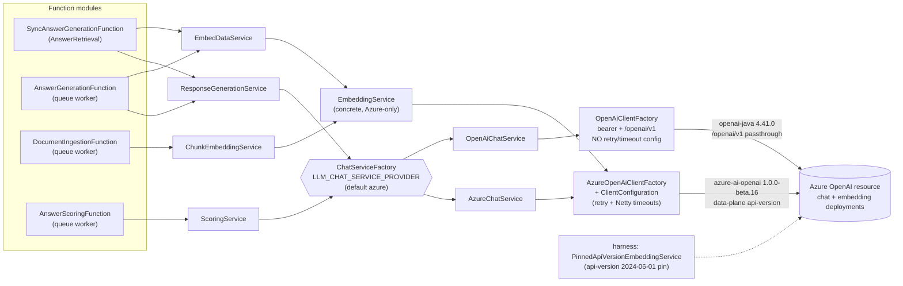
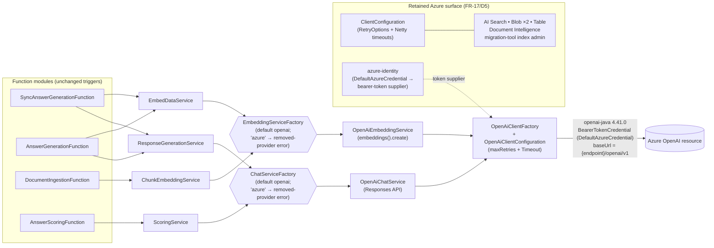
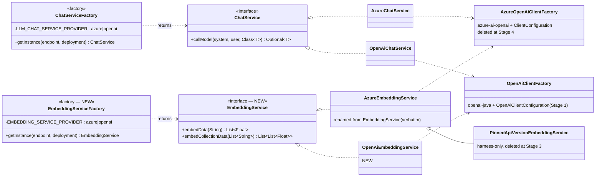
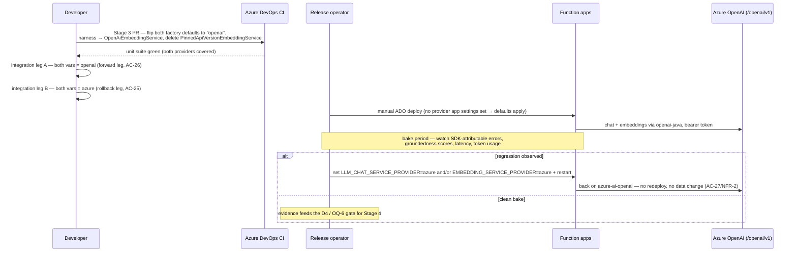

# Design: Migrate off the Azure OpenAI SDK onto the official OpenAI Java SDK (DD-43417)

> Stage 2 pipeline artefact (architecture-designer). Grounded in the code as at 2026-09-15; every element cites a real class/file. Inputs: `docs/pipeline/DD-43417-openai-sdk-migration/00-input-brief.md` (decisions D1–D6) and `01-requirements.md` (FR-1…FR-17, NFR-1…NFR-10, AC-1…AC-30, OQ-1…OQ-9). Feeds story-writing and TDD implementation.

## Summary

Complete the half-finished migration of **all model I/O** — chat *and* embeddings — from the perpetually-beta `com.azure:azure-ai-openai` 1.0.0-beta.16 onto GA `com.openai:openai-java` 4.41.0, talking to the **same Azure-hosted deployments** through the Azure OpenAI **v1 passthrough surface** (`{endpoint}/openai/v1`) with the **same managed-identity bearer token**. Chat is already provider-switchable (`ChatServiceFactory` / `LLM_CHAT_SERVICE_PROVIDER`); this work (a) hardens the OpenAI client with the retry/timeout configuration the Azure client already has, (b) gives embeddings the same interface + factory + toggle shape, (c) flips the defaults, and (d) leaves the Azure implementations in place as the rollback lever until a deferred Stage 4 removes them.

**This changes no trigger, no binding, no queue, no table, no blob and no HTTP contract.** It is internal client-SDK plumbing inside `ai-document-shared-artefacts` plus two constructor call-sites in the function modules. Every stage is independently mergeable and behaviour-neutral at its default setting.

---

## Verified code baseline (what the design must fit)

| Concern | Real code today | Change vector |
|---|---|---|
| Chat provider switch | `ai-document-shared-artefacts/.../client/ChatServiceFactory.java` — `getRequiredEnv(LLM_CHAT_SERVICE_PROVIDER, "azure")`, `switch` on trimmed/lower-cased value, `IllegalArgumentException` naming `azure, openai` | Template for `EmbeddingServiceFactory`; default flipped at Stage 3 |
| Azure chat | `.../service/AzureChatService.java` — `AzureOpenAiClientFactory.getInstance(endpoint)` → `getChatCompletions`, `CompletionsFinishReason` branching, `getPromptFilterResults()`/`getContentFilterResults()` | Unchanged until Stage 4 (gated by Stage 0 spike) |
| OpenAI chat | `.../service/OpenAiChatService.java` — `OpenAiClientFactory.getInstance(endpoint)` → `responses().create(...)`, `response.incompleteDetails()`, usage via `ResponsesApiTokenUsage.report(...)` | Possible FR-11 diagnostics addition after Stage 0 |
| OpenAI client | `.../client/OpenAiClientFactory.java` — `AuthenticationUtil.getBearerTokenSupplier(getCredentialInstance(), "https://cognitiveservices.azure.com/.default")`, `baseUrl(key + "/openai/v1")`, `ConcurrentHashMap` cache, **no `maxRetries`, no `timeout`** | Stage 1: apply `OpenAiClientConfiguration` |
| Azure client | `.../client/AzureOpenAiClientFactory.java` — `retryOptions(getRetryOptions())`, `httpClient(createNettyClient())` | Unchanged until Stage 4 |
| Azure client config | `.../client/config/ClientConfiguration.java` — `AZURE_CLIENT_MAX_RETRIES` (3), `AZURE_CLIENT_BASE_DELAY_IN_SECONDS` (1), `AZURE_CLIENT_MAX_DELAY_IN_SECONDS` (60); Netty `HTTP_CLIENT_{RESPONSE,CONNECT,READ,WRITE}_TIMEOUT_IN_SECONDS` (180/10/60/60) | **Retained verbatim** (FR-17/D5) — also serves Search, 2× Blob, Table, Doc Intelligence, migration-tool index admin |
| Embeddings | `.../service/EmbeddingService.java` — **concrete class, no interface**; `AzureOpenAiClientFactory` → `getEmbeddings(deployment, EmbeddingsOptions)`, `setUser("cp-ai-document-rag-embedding-service")`; `embedData(String)`, `embedCollectionData(List<String>)`; empty `getData()` → WARN + `List.of()`; all exceptions → `EmbeddingServiceException`; `protected EmbeddingService(OpenAIClient, String)` test/subclass seam | Interface extraction + two impls + factory |
| Embedding consumers | `ai-document-answer-retrieval-function/.../retrieval/service/EmbedDataService.java:24` `new EmbeddingService(endpoint, deploymentName)`; `ai-document-ingestion-function/.../ingestion/service/ChunkEmbeddingService.java:35` same, plus `EMBEDDINGS_BATCH_SIZE` (2048) caller-side batching loop | Construct via factory; batching untouched |
| Harness | `ai-document-system-prompt-harness-eval/.../harness/PinnedApiVersionEmbeddingService.java` `extends EmbeddingService`, pins `OpenAIServiceVersion.V2024_06_01`; used by `TestHarness.java:193` and `RetrievalSnapshotTool.java:120` | Transitional `extends AzureEmbeddingService` (Stage 2) → deleted (Stage 3) |
| Integration harness | `ai-service-orchestration-test/.../orchestrator/extension/RagHarness.java` `setupEnvVarMap()` (line 326) — a fixed `Map.ofEntries(...)`; **neither provider var is forwarded** | Forward both provider vars (FR-8) |
| Queue hosts | `ai-document-ingestion-function/host.json` & `ai-document-answer-retrieval-function/host.json`: `maxDequeueCount` 3, `visibilityTimeout` `00:05:00`. `ai-document-answer-scoring-function/host.json`: `maxDequeueCount` 2, `visibilityTimeout` `00:00:30`. **No `functionTimeout` set in any host.json** → hosting-plan default | Timeout sizing must fit inside these (NFR-5, OQ-3) |
| Config docs | `LLM_CHAT_SERVICE_PROVIDER` appears **only** in the harness `.env.sample`/README — it is in **no** function `Azure/local.settings.sample.json` and **not** in root `CLAUDE.md`. `HTTP_CLIENT_WRITE_TIMEOUT_IN_SECONDS` is in no sample either | FR-9 must close both gaps, not just add the new var |

---

## Pattern & Rationale

Against the repo's pattern rubric this is unambiguously **"new capability inside existing modules / reusable component across functions → `ai-document-shared-artefacts`"**:

- **No new trigger or binding.** No `@FunctionName` is added, removed or re-routed. The five HTTP functions, two queue workers and the scorer keep their exact trigger topology.
- **Sync vs async: not applicable / unchanged.** `SyncAnswerGenerationFunction` (`AnswerRetrieval`), the async trio (`InitiateAnswerGeneration` → `AnswerGeneration` worker → `GetAnswerGeneration`), `DocumentIngestionFunction` and `AnswerScoringFunction` all keep their current invocation modes. Only the SDK behind `ChatService` / `EmbeddingService` changes.
- **Reusable across functions → shared artefacts.** Both embedding implementations, the interface and the factory live in `uk.gov.moj.cp.ai.service` / `uk.gov.moj.cp.ai.client`, exactly where `ChatService*` already lives. Nothing is duplicated into a function module.
- **Toggle-gated staged delivery** (D1) mirrors the two precedents in this repo: `LLM_CHAT_SERVICE_PROVIDER` and `CLIENT_FILTERING_ENABLED` (DD-42722). One subtask + PR per stage.

**Rejected shape — big-bang replacement (delete Azure SDK in one PR).** Rejected: it makes rollback a redeploy rather than an app-setting flip (violates NFR-2/D4), it couples the unproven embeddings path to the already-proven chat path, and it forecloses the Stage 0 content-filter spike whose verdict D3 makes a precondition for deleting `AzureChatService`.

**Rejected shape — a single `MODEL_SDK_PROVIDER` toggle covering chat + embeddings.** Rejected: chat is production-evaluated (`ai-document-system-prompt-harness-eval/docs/system-prompt-evaluation-openai-sdk.md`, 80/80 identical citation metrics) while embeddings are not yet exercised at all; one variable would force them to cut over together and would remove the operator's ability to roll back only the leg that misbehaves (D2 explicitly asks for a separate `EMBEDDING_SERVICE_PROVIDER`).

**Rejected shape — abstract the SDK behind a hand-rolled HTTP client.** Rejected outright: re-implements auth, retries and streaming for no benefit, and trades a GA vendor SDK for bespoke code.

---

## Contract Impact

**Internal only — no contract change.** `hmcts/api-cp-ai-rag` (`src/main/resources/openapi/ai-rag-service.openapi.yml`) is **untouched**; the generated `uk.gov.hmcts.cp.openapi` models in `ai-document-shared-artefacts` are **unchanged** (NFR-4). No `operationId` (`initiate-document-upload`, `document-status-by-reference`, `answer-user-query`, `answer-user-query-async`, `answer-user-query-status`), no request/response schema, no status code is affected — an SDK swap behind `ChatService`/`EmbeddingService` is invisible above `ResponseGenerationService`.

Run the `api-contract-check` skill once on the Stage 3 PR purely as a regression assertion (expect "no diff"); it is not a gate for Stages 0–2.

---

## Current state → target state

### Current (mixed-SDK)



### Target (post-Stage 4 end-state)



The only edges deleted between the two pictures are `AzureOpenAiClientFactory` + `AzureChatService` + `AzureEmbeddingService` + the `azure-ai-openai` artefact. `azure-identity` and `ClientConfiguration` survive and keep serving the six non-OpenAI clients.

---

## Stage 1 — OpenAI client hardening (FR-1, FR-2, FR-3; AC-1…AC-6)

### New class: `uk.gov.moj.cp.ai.client.config.OpenAiClientConfiguration`

Sibling of `ClientConfiguration` in `ai-document-shared-artefacts/src/main/java/uk/gov/moj/cp/ai/client/config/`. Reads env via `EnvVarUtil.getRequiredEnvAsInteger` — the same static seam `ClientConfigurationTest` already stubs with `Mockito.mockStatic(EnvVarUtil.class)`, so the unit tests are a direct copy of an existing, working pattern.

```java
public final class OpenAiClientConfiguration {

    // Deliberately identical defaults to ClientConfiguration so both SDK paths behave alike
    // while the toggle exists (NFR-10, OQ-2).
    private static final String DEFAULT_MAX_RETRIES              = "3";
    private static final String DEFAULT_REQUEST_TIMEOUT_SECONDS  = "180";  // HTTP_CLIENT_RESPONSE_*
    private static final String DEFAULT_CONNECT_TIMEOUT_SECONDS  = "10";
    private static final String DEFAULT_WRITE_TIMEOUT_SECONDS    = "60";

    /** @return openai-java maxRetries. NOTE: backoff base/max are fixed in the SDK (see class Javadoc). */
    public static int getMaxRetries() { ... }

    /** @return com.openai.core.Timeout with request/connect/read/write phases. */
    public static Timeout getTimeout() {
        return Timeout.builder()
                .request(Duration.ofSeconds(responseSeconds))  // HTTP_CLIENT_RESPONSE_TIMEOUT_IN_SECONDS
                .connect(Duration.ofSeconds(connectSeconds))   // HTTP_CLIENT_CONNECT_TIMEOUT_IN_SECONDS
                .read(Duration.ofSeconds(responseSeconds))     // OkHttp read bounds first-byte wait → response value
                .write(Duration.ofSeconds(writeSeconds))       // HTTP_CLIENT_WRITE_TIMEOUT_IN_SECONDS
                .build();
    }
}
```

Class Javadoc must state (FR-3 / AC-6) that `AZURE_CLIENT_BASE_DELAY_IN_SECONDS` and `AZURE_CLIENT_MAX_DELAY_IN_SECONDS` **have no effect on this client** — openai-java's backoff curve is not configurable. Both variables continue to configure the six Azure clients through `ClientConfiguration`; setting them must never fail a build (AC-6).

A single INFO line at first construction logs the effective `maxRetries` + four timeout values (AC-3), mirroring `ClientConfiguration`'s existing "Creating Netty HTTP client with …" line. It is emitted from the factory's `computeIfAbsent` lambda so the caching invariant (AC-4, one line per endpoint) holds.

### Env-var mapping

| Env var | Today (Azure, Netty) | New (openai-java) | Default (unchanged) |
|---|---|---|---|
| `AZURE_CLIENT_MAX_RETRIES` | `ExponentialBackoffOptions.setMaxRetries` | `OpenAIOkHttpClient.Builder.maxRetries(int)` | `3` |
| `AZURE_CLIENT_BASE_DELAY_IN_SECONDS` | `setBaseDelay` | **no equivalent** — documented no-op on this client | `1` |
| `AZURE_CLIENT_MAX_DELAY_IN_SECONDS` | `setMaxDelay` | **no equivalent** — documented no-op on this client | `60` |
| `HTTP_CLIENT_RESPONSE_TIMEOUT_IN_SECONDS` | `NettyAsyncHttpClientBuilder.responseTimeout` | `Timeout.request` **and** `Timeout.read` | `180` |
| `HTTP_CLIENT_CONNECT_TIMEOUT_IN_SECONDS` | `connectTimeout` | `Timeout.connect` | `10` |
| `HTTP_CLIENT_READ_TIMEOUT_IN_SECONDS` | `readTimeout` | **no equivalent applied** — documented no-op on this client (see below) | `60` |
| `HTTP_CLIENT_WRITE_TIMEOUT_IN_SECONDS` | `writeTimeout` | `Timeout.write` | `60` |

`HTTP_CLIENT_RESPONSE_*` → `Timeout.request` is the right mapping: Netty's `responseTimeout` bounds the wait for a complete response, and `com.openai.core.Timeout#request` is documented as *"the maximum time allowed for a complete HTTP call, **not including retries** … resolving DNS, connecting, writing the request body, server processing, as well as reading the response body"*. **The read phase also takes the response value** (corrected at Stage 1 code review): `Timeout.read` maps onto OkHttp's `readTimeout`, which — unlike Netty's `readTimeout` — also bounds the wait for the *first* response byte. Our Responses-API calls are non-streaming, so the model's entire processing time falls inside that first read; mapping the 60 s read var onto it would cap model latency at 60 s versus 180 s on the Azure leg. `HTTP_CLIENT_READ_TIMEOUT_IN_SECONDS` therefore joins the backoff delay vars as Azure-SDK-only. `Timeout.write` remains a genuine inter-packet bound (request bodies are small).

### `OpenAiClientFactory` wiring (FR-2)

Only two builder lines are added; base URL, credential and cache are untouched (AC-5):

```java
return OpenAIOkHttpClient.builder()
        .baseUrl(key + "/openai/v1")
        .credential(BearerTokenCredential.create(SHARED_BEARER_TOKEN_SUPPLIER))
        .maxRetries(OpenAiClientConfiguration.getMaxRetries())   // FR-2 / AC-1
        .timeout(OpenAiClientConfiguration.getTimeout())          // FR-2 / AC-2
        .build();
```

### Retry-semantics delta (accepted, must be documented — FR-3/NFR-9)

| Aspect | Azure SDK (`ClientConfiguration.getRetryOptions()`) | openai-java 4.41.0 (`RetryingHttpClient`) | Delta |
|---|---|---|---|
| Max retries | `AZURE_CLIENT_MAX_RETRIES`, default **3** | `maxRetries(int)`, SDK default 2 → we set **3** | None once configured |
| Backoff curve | Exponential, **base + max configurable** (1 s → 60 s) | Fixed `min(0.5 × 2^(n−1), 8.0)` s → 0.5, 1, 2 … capped 8 s | **Configurability lost** (accepted) |
| Jitter | Azure Core applies jitter | `1 − 0.25 × random()` multiplier | Equivalent |
| `Retry-After` | Azure Core honours the well-known headers | Honours `Retry-After-Ms`, `Retry-After` (numeric or RFC-1123) **verbatim, uncapped** | Materially equivalent; openai-java applies no max-delay cap |
| Retried statuses | Azure Core retry policy (408/429/5xx + IO) | `X-Should-Retry` override, then 408, 409, 429, ≥500, and `IOException`/`OpenAIIoException`/`OpenAIRetryableException` | openai-java additionally honours `X-Should-Retry` and retries 409 |
| Non-repeatable bodies | n/a | Not retried (`request.body.repeatable()`) | Irrelevant — no streamed request bodies here |
| Timeout scope | Per-attempt (`responseTimeout`) | Per-attempt (`Timeout.request`, *excluding* retries) | Equivalent |

### OQ-3 — request-timeout ceiling: **resolved, 180 s is safe; documented worst case below**

Facts from the repo, not assumption:

- **No `functionTimeout` is set** in any of the five `host.json` files → the hosting plan default applies. The apps run on **Premium and Standard/Dedicated plans** (`ai-document-system-prompt-harness-eval/docs/Intro.md`), whose default `functionTimeout` is **30 minutes**.
- Queue workers: ingestion and answer-retrieval `host.json` both set `visibilityTimeout 00:05:00` (300 s) and `maxDequeueCount 3`; `IDEMPOTENCY_LEASE_TTL_SECONDS` defaults to `300`. The CLAUDE.md invariant `IDEMPOTENCY_LEASE_TTL_SECONDS < visibilityTimeout × (maxDequeueCount − 1)` = 300 < 600 continues to hold — **this work changes none of those values**.

| Scenario (single `ChatService`/`EmbeddingService` call) | Arithmetic | Result |
|---|---|---|
| **Hard ceiling** — every attempt burns the full request timeout | (3 retries + 1) × 180 s + backoff (0.5 + 1 + 2 s, jittered) | **≈ 723 s ≈ 12.1 min** |
| Margin to host `functionTimeout` (30 min default) | 1800 − 723 | **≈ 18 min headroom** (NFR-5 satisfied) |
| **Realistic stall bound** — a hung/stalled connection trips `Timeout.read` (= response value, 180 s) | 4 × 180 s + ~3.5 s backoff | ≈ 723 s — identical to the Azure leg's exposure (below) |
| Pre-existing Azure-path equivalent | 4 × 180 s (Netty `responseTimeout`) + 1+2+4 s | ≈ 727 s — **identical exposure today** |

**Recommendation (OQ-3): keep `HTTP_CLIENT_RESPONSE_TIMEOUT_IN_SECONDS=180` and map it to `Timeout.request` (and, per the Stage 1 review correction, to `Timeout.read`).** It sits comfortably inside the 30-minute host default with ≈18 minutes of headroom. The 12.1-minute theoretical ceiling exceeds the 300 s idempotency lease TTL, but (a) it is **exactly the exposure that exists today** on the Azure path (4 × 180 s Netty `responseTimeout`) — this work introduces no regression — and (b) lease expiry under a still-running worker is not a correctness failure: the claim-time ETag fences the terminal write, the late worker gets a 412 (`EtagMismatchException`), discards its result and never enqueues scoring. Record two follow-ups rather than widening this ticket:

1. **Pin `functionTimeout` explicitly** in the queue-worker `host.json` files (e.g. `00:10:00`) so the budget is not silently inherited from a plan change. A Consumption-plan app would default to 5 minutes and truncate the retry chain.
2. **Reconcile the retry-chain ceiling with the lease TTL** — either lower the model-call request timeout or raise `IDEMPOTENCY_LEASE_TTL_SECONDS` (headroom to 600 s exists before the `visibilityTimeout × (maxDequeueCount − 1)` bound bites).

Also noted for the record: `ai-document-answer-scoring-function/host.json` runs `visibilityTimeout 00:00:30` with `maxDequeueCount 2`, so a judge-model call slower than 30 s is already redelivered concurrently today. Pre-existing, unaffected by this work, worth its own ticket.

### OQ-1 — env-var naming: **recommend reuse now, rename optionally at Stage 4**

**Recommendation: reuse `AZURE_CLIENT_MAX_RETRIES` and `HTTP_CLIENT_*_TIMEOUT_IN_SECONDS` as briefed (no new variables in Stage 1).**

- Zero operational churn: every `Azure/local.settings.sample.json`, every environment's app settings and the harness `.env` already carry these values. Introducing `OPENAI_CLIENT_*` means a coordinated app-settings change in every environment *before* Stage 1 can be deployed, for a purely cosmetic gain.
- It keeps both toggle legs configured identically, which is the point of a toggle: an operator flipping `azure ⇄ openai` gets the same retry/timeout budget either way, so a behavioural difference is attributable to the SDK and not to divergent tuning.
- The naming is misleading in exactly one respect (`AZURE_` on a non-Azure SDK client); mitigate with the `OpenAiClientConfiguration` Javadoc and the `CLAUDE.md` entry, not with a rename mid-migration.
- **Deferred option, Stage 4:** once `azure-ai-openai` is gone, introduce `OPENAI_CLIENT_MAX_RETRIES` / `OPENAI_CLIENT_*_TIMEOUT_IN_SECONDS` reading the legacy names as fallback, deprecate for one release, then drop. That is a clean, reversible rename with no cut-over risk. `HTTP_CLIENT_*` legitimately stays shared — the six other Azure clients still use it.

### OQ-2 — retry-count default: **recommend 3 (keep `ClientConfiguration`'s default)**

**Recommendation: `DEFAULT_MAX_RETRIES = "3"`** in `OpenAiClientConfiguration`, i.e. adopt the repo default rather than openai-java's 2.

- Continuity is the whole premise of the staged migration: an environment with unchanged app settings must behave the same before and after the toggle flip (NFR-10). Silently dropping from 3 to 2 inner retries changes 429-resilience at exactly the moment we want a clean A/B.
- The queue-level redelivery budget (`maxDequeueCount` 3) is an *outer* retry of a whole invocation (re-embed → re-search → LLM), not a substitute for in-call 429 handling; Azure OpenAI throttling is far better absorbed by the inner retry with `Retry-After` than by a full re-run.
- The sync HTTP path (`AnswerRetrieval`) has **no** outer retry at all, so the inner count is the only resilience it has.
- Cost of 3 vs 2 is bounded and quantified in the OQ-3 table.

### Stage 1 tests

- `OpenAiClientConfigurationTest` (new): `Mockito.mockStatic(EnvVarUtil.class)` stubbing each `getRequiredEnvAsInteger(key, default)` → assert `getMaxRetries()` and assert `getTimeout().request()/connect()/read()/write()` (AC-1, AC-2); a defaults case verifying the documented defaults are the ones requested, not the SDK's (AC-3).
- `OpenAiClientFactoryTest` (extend the existing 5): caching/`assertSame` behaviour preserved (AC-4); a package-private `buildClient(String endpoint)` seam (or `applyConfiguration(OpenAIOkHttpClient.Builder)`) verified with a Mockito spy so `.maxRetries(...)`/`.timeout(...)` invocation is asserted — Mockito 5.x with the inline mock maker handles the final Kotlin builder, as `OpenAiChatServiceTest`'s deep-stub pattern already demonstrates. Add a case proving `AZURE_CLIENT_BASE_DELAY_IN_SECONDS`/`MAX_DELAY` being set does not break the build (AC-6).
- No integration test needed for Stage 1; the existing suite exercises the client implicitly.

---

## Stage 2 — embeddings provider switch (FR-4…FR-9; AC-7…AC-19)

Zero behaviour change at the default. This is a refactor + a second implementation that nothing selects until Stage 3.

### Provider-switch class structure (mirrors the chat side exactly)



### FR-4 — interface extraction (exact signatures, no consumer change)

`ai-document-shared-artefacts/src/main/java/uk/gov/moj/cp/ai/service/EmbeddingService.java` becomes:

```java
public interface EmbeddingService {
    List<Float> embedData(String content) throws EmbeddingServiceException;
    List<List<Float>> embedCollectionData(List<String> contents) throws EmbeddingServiceException;
}
```

Name, package, method names, parameter types, return types and the checked `EmbeddingServiceException` are **identical to today**, so every consumer import (`uk.gov.moj.cp.ai.service.EmbeddingService`) and every `@Mock EmbeddingService` in `EmbedDataServiceTest`, `ChunkEmbeddingServiceTest`, `ChunkEmbeddingServiceClientIdentityTest` and the harness continue to compile untouched (AC-7). The `IllegalArgumentException` contracts (`"Content to embed cannot be null or empty"`, `"Content list cannot be null or empty"`) stay in the implementations — they are unchecked and part of the observable behaviour.

### FR-4 — `AzureEmbeddingService` (rename, verbatim body)

New file `.../service/AzureEmbeddingService.java`, class body copied **character-for-character** from today's `EmbeddingService` (including the `protected AzureEmbeddingService(OpenAIClient, String)` seam the harness subclass and `EmbeddingServiceTest` rely on) with `implements EmbeddingService` and `@Override` added. A Javadoc line records it is scheduled for deletion at Stage 4 (FR-15).

### FR-5 — `OpenAiEmbeddingService`

New file `.../service/OpenAiEmbeddingService.java`:

```java
public class OpenAiEmbeddingService implements EmbeddingService {

    private static final String USER_TAG = "cp-ai-document-rag-embedding-service";

    private final OpenAIClient openAIClient;      // com.openai.client.OpenAIClient
    private final String embeddingDeploymentName;

    public OpenAiEmbeddingService(final String endpoint, final String deploymentName) {
        validateNullOrEmpty(endpoint, "Endpoint environment variable for embedding service must be set.");
        validateNullOrEmpty(deploymentName, "Deployment name environment variable for embedding service must be set.");
        LOGGER.info("Connecting to embedding service endpoint '{}' and deployment '{}'", endpoint, deploymentName);
        this.openAIClient = OpenAiClientFactory.getInstance(endpoint);   // Stage-1-hardened client
        this.embeddingDeploymentName = deploymentName;
    }

    protected OpenAiEmbeddingService(final OpenAIClient openAIClient, final String deploymentName) { ... }

    @Override
    public List<Float> embedData(final String content) throws EmbeddingServiceException {
        // identical to AzureEmbeddingService: validate, delegate to embedCollectionData(List.of(content)), get(0)
    }

    @Override
    public List<List<Float>> embedCollectionData(final List<String> contents) throws EmbeddingServiceException {
        if (contents == null || contents.isEmpty()) {
            throw new IllegalArgumentException("Content list cannot be null or empty");   // AC-11: same message
        }
        LOGGER.info("Embedding {} content strings in batch", contents.size());

        final EmbeddingCreateParams params = EmbeddingCreateParams.builder()
                .model(embeddingDeploymentName)          // Azure deployment name (EmbeddingModel.of) — AC-12
                .inputOfArrayOfStrings(contents)         // one request per call — AC-8/AC-17
                .user(USER_TAG)                          // AC-12; see OQ-8
                .build();
        try {
            final CreateEmbeddingResponse response = openAIClient.embeddings().create(params);
            final List<Embedding> data = response.data();
            if (data == null || data.isEmpty()) {
                LOGGER.warn("No embedding data returned for content");   // AC-9: warn + empty, no throw
                return List.of();
            }
            final List<List<Float>> embeddings = data.stream()
                    .sorted(comparingLong(Embedding::index))             // AC-8: restore input order
                    .map(Embedding::embedding)                           // List<Float> — drop-in (NFR-1)
                    .toList();
            LOGGER.info("Successfully embedded {} queries", embeddings.size());
            return embeddings;
        } catch (final Exception e) {
            throw new EmbeddingServiceException("Failed to embed content", e);   // AC-10: no SDK type leaks
        }
    }
}
```

Verified SDK facts behind this: `Embedding.embedding()` returns `List<Float>` (via `EmbeddingValue.asFloats()`) — a true drop-in for `EmbeddingItem::getEmbedding` (NFR-1); `Embedding.index()` returns `long`, hence `comparingLong`; `EmbeddingCreateParams.Builder.model(String)` resolves to `EmbeddingModel.of(value)` so the Azure **deployment name** passes through unchanged; `user(String)` exists on the builder.

**Explicit sort, not reliance on array order** (the Azure impl relies on order implicitly): the v1 surface is a different transport and the API contract guarantees `index`, not array position. Sorting is cheap (≤ `EMBEDDINGS_BATCH_SIZE` elements) and makes the ordering guarantee testable (AC-8) rather than assumed. The `chunkVector`↔chunk association in `ChunkEmbeddingService.enrichChunksWithEmbeddings` is positional, so a silent reordering would mis-associate every vector in a batch — the one truly damaging failure mode of this migration, and the reason it gets an explicit guard and an explicit test.

### FR-6 — `EmbeddingServiceFactory`

New file `ai-document-shared-artefacts/src/main/java/uk/gov/moj/cp/ai/client/EmbeddingServiceFactory.java`, a line-for-line analogue of `ChatServiceFactory`:

- public `getInstance(endpoint, deploymentName)` → `getRequiredEnv(EMBEDDING_SERVICE_PROVIDER, PROVIDER_AZURE)`;
- package-private `getInstance(endpoint, deploymentName, provider)` overload for tests (same seam `ChatServiceFactoryTest` uses);
- null/blank → default + INFO log (AC-13); `provider.trim().toLowerCase()` switch (AC-14); default branch → `IllegalArgumentException("Unknown EMBEDDING_SERVICE_PROVIDER value: '" + provider + "'. Expected one of: azure, openai.")` (AC-15);
- provider choice logged once at construction (NFR-6).

`EMBEDDING_SERVICE_PROVIDER` is added to `SharedSystemVariables` next to `LLM_CHAT_SERVICE_PROVIDER` (line 31).

### FR-7 — consumer wiring (two lines)

- `ai-document-answer-retrieval-function/.../retrieval/service/EmbedDataService.java:24` → `embeddingService = EmbeddingServiceFactory.getInstance(endpoint, deploymentName);`
- `ai-document-ingestion-function/.../ingestion/service/ChunkEmbeddingService.java:35` → same.

Both keep their existing package-private/public injection constructors taking `EmbeddingService` — now the interface — so all consumer tests are unchanged (AC-16). `EMBEDDINGS_BATCH_SIZE` batching, the mismatch guard (`embeddings.size() != batch.size()`) and `DocumentProcessingException` wrapping in `ChunkEmbeddingService` are untouched (AC-17).

### FR-8 — `RagHarness` env forwarding

`ai-service-orchestration-test/.../orchestrator/extension/RagHarness.java` `setupEnvVarMap()` is a fixed `Map.ofEntries(...)`; add two entries sourced from the test process environment with explicit defaults so an unset variable reproduces today's behaviour:

```java
Map.entry("LLM_CHAT_SERVICE_PROVIDER",  getRequiredEnv("LLM_CHAT_SERVICE_PROVIDER",  "azure")),
Map.entry("EMBEDDING_SERVICE_PROVIDER", getRequiredEnv("EMBEDDING_SERVICE_PROVIDER", "azure")),
```

(At Stage 3 the defaults here flip to `openai` in step with the factories, so an unset run still mirrors production.) All five hosts receive the same map, which correctly covers `ai-document-answer-scoring-function` (its `ScoringService` also builds through `ChatServiceFactory`). AC-18 asserts on `setupEnvVarMap()` output.

### FR-9 — configuration surface (wider than the FR text implies)

Two pre-existing documentation gaps must be closed in this PR, because Stage 3 flips a default that is currently invisible to operators:

| File | Action |
|---|---|
| `ai-document-answer-retrieval-function/Azure/local.settings.sample.json` | add `EMBEDDING_SERVICE_PROVIDER` **and the currently-missing `LLM_CHAT_SERVICE_PROVIDER`** and `HTTP_CLIENT_WRITE_TIMEOUT_IN_SECONDS` |
| `ai-document-ingestion-function/Azure/local.settings.sample.json` | add `EMBEDDING_SERVICE_PROVIDER` (+ `HTTP_CLIENT_WRITE_TIMEOUT_IN_SECONDS`) |
| `ai-document-answer-scoring-function/Azure/local.settings.sample.json` | add `LLM_CHAT_SERVICE_PROVIDER` (judge model goes through `ChatServiceFactory`) |
| `ai-document-system-prompt-harness-eval/.env.sample` + `README.md` | add `EMBEDDING_SERVICE_PROVIDER=azure` beside the existing `LLM_CHAT_SERVICE_PROVIDER=azure` |
| `ai-service-orchestration-test/.env.sample` | document both provider vars as optional leg selectors |
| Root `CLAUDE.md` "Key environment variables" | new entry covering **both** toggles, accepted values, defaults, the Stage-3 default flip, and the FR-3 note that `AZURE_CLIENT_BASE_DELAY_IN_SECONDS`/`MAX_DELAY` do not apply to the OpenAI client |

### OQ-7 — Azure-coupled test disposition: **recommend keeping `EmbeddingServiceTest` as-is**

**Recommendation: rename the file to `AzureEmbeddingServiceTest`, retarget it at `AzureEmbeddingService`, and leave the `DefaultJsonReader` fixtures untouched.**

The internal-API coupling (`com.azure.json.implementation.DefaultJsonReader`) is real but has a known expiry date: the whole class is deleted at Stage 4 together with its subject (AC-28). Rewriting those five tests onto public builders spends effort on code with a scheduled deletion, adds a non-trivial fixture rewrite to a PR whose value is "zero behaviour change", and risks weakening the parity evidence at the exact moment `AzureEmbeddingService` is the rollback target. The pinned SDK version means the internal API cannot drift underneath us (no version bump is planned — Dependencies section). The new `OpenAiEmbeddingServiceTest` uses public builders (`CreateEmbeddingResponse.builder()`, `Embedding.builder()`) so the *surviving* suite has no internal coupling.

### OQ-8 — `user` tag on `/openai/v1`: **recommend keeping it, verify in the Stage 2 PR**

Keep `.user("cp-ai-document-rag-embedding-service")` (AC-12): `user` is a first-class field of the OpenAI embeddings request that the v1 passthrough forwards, it carries no PII (a fixed service label, not an end-user identifier), and dropping it would lose an abuse-monitoring dimension the Azure path has today. **Verification step for the implementer:** one manual/harness call against a real v1 deployment confirming a 200 (not a 400 "unrecognised parameter"). If it is rejected, drop the field, record it in the PR description as a documented parity gap (NFR-9), and add it to the Stage 0 findings note — nothing else depends on it.

### Stage 2 tests

- `OpenAiEmbeddingServiceTest` (new): happy path with N inputs returning **out-of-order** `Embedding.index()` values, asserting input-order output and exactly one `embeddings().create` call (AC-8); empty `data()` → empty list + no throw (AC-9); SDK exception → `EmbeddingServiceException` (AC-10); null/empty input → `IllegalArgumentException` with the exact message (AC-11); `ArgumentCaptor<EmbeddingCreateParams>` asserting `model` = deployment and `user` = the tag (AC-12).
- `EmbeddingServiceFactoryTest` (new): default/unset, `openai`, ` OpenAI ` mixed-case+whitespace, `azure`, unrecognised value message (AC-13…AC-15) — mirroring `ChatServiceFactoryTest`'s 10 cases.
- `AzureEmbeddingServiceTest` (renamed, unchanged content) and all consumer tests continue to pass unmodified (AC-7, NFR-7).
- Integration: no new tests; the existing suite runs on the unchanged `azure` default and must stay green (proof of NFR-10).

---

## Stage 0 — content-filter parity spike (FR-10, FR-11; AC-20…AC-22)

Runs in parallel with Stages 1–2; **gates only the Stage 4 chat deletion** (D3), not the cut-over.

**What the Azure path gives today** (`AzureChatService.generateExplanationForEmptyResponse`, lines 184–208): on `CompletionsFinishReason.CONTENT_FILTERED` it serialises `chatCompletions.getPromptFilterResults()` (input-side categories/severities) and `chatChoice.getContentFilterResults()` (output-side) into a WARN, and branches separately on `TOKEN_LIMIT_REACHED`. `OpenAiChatService` has no equivalent — it logs `response.status()` and warns when `response.incompleteDetails()` is present.

**What to test in the spike:**

1. **Filtered *prompt* (input) through `/openai/v1`.** Expected: the call **fails** rather than returning a choice — HTTP **400** with an error body whose `code` is `content_filter` and whose `innererror.content_filter_result` carries the per-category severities. Through openai-java that surfaces as `com.openai.errors.BadRequestException` (extends `OpenAIServiceException`), giving `statusCode()` = 400, `code()` = `Optional["content_filter"]`, `type()`, `param()`, `headers()` and `body()` as a `JsonValue`. **Confirm whether `innererror` survives into `body()`** — that is the single most important question of the spike, because it determines whether category/severity detail is recoverable at all.
2. **Filtered *completion* (output).** Expected: a 200 whose `response.status()` is `incomplete` with `incompleteDetails().reason()` set (`content_filter` / `max_output_tokens`), or a truncated output with no annotation. Record which.
3. **Successful, unfiltered response.** Confirm explicitly whether *any* filter annotation appears (AC-20 requires a yes/no).
4. **Retry interaction.** A 400 is not retryable under `RetryingHttpClient.shouldRetry`, so a content-filter trip fails fast — confirm it is not silently consuming the retry budget, and note how it lands in the async worker (a `ChatServiceException`/SDK exception rides queue redelivery up to `maxDequeueCount` 3 and burns all three attempts on a deterministically-filtered prompt).

**Likely FR-11 outcome** (design it now, implement if the spike confirms the gap): in `OpenAiChatService.callModel`, catch `OpenAIServiceException` and emit one WARN carrying `statusCode()`, `code()`, `type()`, `param()` and — if present — the `innererror.content_filter_result` categories/severities extracted from `body()`, then rethrow as `ChatServiceException`. Separately, upgrade the existing `incompleteDetails()` branch to log the **reason** (distinguishing `content_filter` from `max_output_tokens`), restoring the `CONTENT_FILTERED` vs `TOKEN_LIMIT_REACHED` distinction the Azure path has. **AC-22 constraint: category names and severities only — never the prompt, the user query, the retrieved chunks or the model output.** The existing `LOGGER.warn("LLM produced incomplete response …")` line already respects this.

**Where the findings live (OQ-4 recommendation):** `docs/pipeline/DD-43417-openai-sdk-migration/03-content-filter-parity-findings.md`, i.e. with the ticket's other artefacts, not in the harness `docs/` — the verdict is a delivery gate on Stage 4, not an evaluation result. **Where to provoke it:** the offline harness against a **non-production** Azure OpenAI resource, using a benign-but-reliably-filtered prompt; never production, never with real case material.

**Verdict recorded as a Stage 4 gate** (AC-21): "parity achieved" or "gap X → logging change Y", linked from the Stage 4 subtask's description.

---

## Stage 3 — cut-over (FR-12, FR-13, FR-14; AC-23…AC-27)



- **FR-12 default flip:** `ChatServiceFactory.getInstance(...)` default argument `PROVIDER_AZURE` → `PROVIDER_OPENAI`, plus the null/blank branch's log message and returned type; same in `EmbeddingServiceFactory`. Also flip the `RagHarness` forwarding defaults so an unset integration run mirrors production.
- **FR-13 harness move:** `TestHarness.java:193` and `RetrievalSnapshotTool.java:120` construct `EmbeddingServiceFactory.getInstance(endpoint, deployment)` (honouring the harness `.env`, consistent with how the harness already selects chat), the `PinnedApiVersionEmbeddingService` file is deleted, and the two "hardened resources reject the default preview api-version" comments (`TestHarness.java:192`, `RetrievalSnapshotTool.java:119`) plus the harness README/`.env.sample` api-version notes are removed (AC-24). The workaround's premise disappears with the Azure data-plane api-version: `/openai/v1` is not a preview surface.
- **FR-14 rollback proof:** run the full `./ai-service-orchestration-test/run-integration-test.sh` twice — once with both vars `azure`, once with both `openai` — asserting the same ingestion and answer-generation journeys and equivalent statuses (AC-25/AC-26). Rollback stays config-only (AC-27).

**OQ-5 — cut-over granularity (recommendation):** flip **embeddings first**, chat second, with a bake between, and environment-by-environment (dev → test → prod). Rationale grounded in the evidence: the chat path already has 80/80 harness parity, so it is the *lower*-risk leg and can afford to go second; embeddings have **no** production exercise at all, so they deserve an isolated bake where any retrieval-quality change is unambiguously attributable. The code supports either order at zero cost — two independent app settings. If the release operator prefers a single deploy, that is acceptable but the bake evidence then cannot separate the two causes.

**OQ-9 — integration matrix cost (recommendation):** run the forward leg (`openai`) in CI on the Stage 3 PR, and the rollback leg (`azure`) as a **locally-run pre-merge gate** whose output is pasted into the PR description. Doubling real-Azure integration cost on every subsequent PR buys little: after Stage 3 the `azure` leg is a deprecated path awaiting deletion, and its behaviour is frozen (the code is untouched from Stage 2 onward). Owner decision, but this is the cheap and defensible split.

---

## Stage 4 — deferred removal end-state (FR-15, FR-16; AC-28…AC-30)

**Not scheduled by this design.** Preconditions: the D4/OQ-6 "fully exercised in production" gate is closed **and** the Stage 0 verdict (FR-10/FR-11) is recorded.

**Deleted:**
- `ai-document-shared-artefacts/src/main/java/uk/gov/moj/cp/ai/service/AzureChatService.java`
- `ai-document-shared-artefacts/src/main/java/uk/gov/moj/cp/ai/service/AzureEmbeddingService.java`
- `ai-document-shared-artefacts/src/main/java/uk/gov/moj/cp/ai/client/AzureOpenAiClientFactory.java`
- their tests: `AzureChatServiceTest` (13), `AzureEmbeddingServiceTest` (5, the `DefaultJsonReader` fixtures go with it — OQ-7), `AzureOpenAiClientFactoryTest` (5)
- `com.azure:azure-ai-openai` from root `pom.xml` `<dependencyManagement>` (line ~152) and `ai-document-shared-artefacts/pom.xml` (line ~27); `mvn dependency:tree` must show it in no module (AC-28)

**Fail-fast on a stale setting (FR-16/AC-29):** both factories gain an explicit `azure` branch **before** the default branch:

```java
case PROVIDER_AZURE -> throw new IllegalStateException(
        "EMBEDDING_SERVICE_PROVIDER: provider 'azure' has been removed (DD-43417 Stage 4). "
      + "The Azure OpenAI SDK path no longer exists; remove this app setting or set it to 'openai'.");
```

Deliberately distinct from the unknown-value `IllegalArgumentException`: a stale app setting after removal is an operator-actionable configuration error, and "unknown value: 'azure'" would read as a typo. Both factories throw at construction, so the function fails to start rather than failing the first request.

**Explicitly retained (FR-17/D5/AC-30):** `com.azure:azure-identity` (the `AuthenticationUtil.getBearerTokenSupplier` source for `OpenAiClientFactory`, plus every other Azure client) and `ClientConfiguration` with its `RetryOptions` + Netty timeouts, still serving AI Search, both Blob clients, Table, Document Intelligence and the migration-tool index admin client. `ClientConfigurationTest` stays. Optional here (not required): the OQ-1 `OPENAI_CLIENT_*` rename with legacy fallback.

---

## Reliability

Nothing in the queue/idempotency machinery changes; this section states the invariants the new client must not break.

- **Idempotency:** `IdempotencyGuard.runOnce(key, work)` keyed on `documentId` / `transactionId`, the ETag/If-Match lease claim, terminal-row skip (`INGESTION_SUCCESS`/`INGESTION_FAILED`/`FILE_SIZE_OVER_LIMIT`, `ANSWER_GENERATED`/`ANSWER_GENERATION_FAILED`), lease-release-before-rethrow and the WARN-and-leave-non-terminal behaviour at exhaustion against a live lease — all untouched. An SDK swap inside the guarded work unit is invisible to the guard.
- **Redelivery:** an OpenAI-path failure (`ChatServiceException`, `EmbeddingServiceException`, or an `OpenAIServiceException` escaping as a cause) propagates exactly as an Azure-path failure does today, riding queue redelivery up to `maxDequeueCount` 3 with the lease released before each rethrow. The citation-guard retry semantics documented in `CLAUDE.md` are unaffected — `CitationDegradedException` is thrown by `ResponseGenerationService` above the SDK boundary.
- **Lease-TTL invariant:** `IDEMPOTENCY_LEASE_TTL_SECONDS` (300) < `visibilityTimeout` (300 s) × (`maxDequeueCount` 3 − 1) = 600 s — unchanged. The new client's timeout budget is analysed against it in the OQ-3 table: the ≈ 723 s retry-chain ceiling exceeds the lease, but is the pre-existing Azure-path exposure (4 × 180 s), fenced (not corrupted) by the claim-time ETag.
- **Poison/exhaustion:** unchanged. Note for triage: a deterministically content-filtered prompt will burn all three delivery attempts and land on the configured `CITATION_GUARD_MODE`/failure path — another reason the FR-11 logging matters.
- **Retrieval invariants:** untouched. `SEARCH_NEAREST_NEIGHBOURS_COUNT ≥ SEARCH_TOP_RESULTS_COUNT > SEARCH_MMR_FINAL_COUNT` (50 ≥ 50 > 15), stage order containment dedup → semantic dedup → MMR, and `LLM_MODEL_RESPONSE_MAX_TOKENS` are all outside this change. The only retrieval-adjacent risk is **embedding-vector equivalence** (NFR-1) — same deployment, same model, `List<Float>` drop-in, ordering explicitly restored.

---

## Cross-cutting

- **Auth (managed identity, NFR-3):** no new credential path. `OpenAiClientFactory` keeps the single shared `AuthenticationUtil.getBearerTokenSupplier(getCredentialInstance(), "https://cognitiveservices.azure.com/.default")` → `BearerTokenCredential`, and `OpenAiEmbeddingService` reuses that same cached client per endpoint. No API keys, connection strings, SAS or account keys are introduced. Bearer tokens are never logged — the new logging is confined to config values, provider names and error metadata.
- **New env var:** `EMBEDDING_SERVICE_PROVIDER` (`azure` | `openai`; default `azure` at Stage 2, `openai` at Stage 3). Documented in the answer-retrieval and ingestion `Azure/local.settings.sample.json`, the harness `.env.sample`/README, `ai-service-orchestration-test/.env.sample`, and root `CLAUDE.md` (FR-9). No other new variables — Stage 1 deliberately reuses existing names (OQ-1).
- **Config debt closed in passing:** `LLM_CHAT_SERVICE_PROVIDER` is currently documented **nowhere** except the harness, and `HTTP_CLIENT_WRITE_TIMEOUT_IN_SECONDS` in no sample at all. Both get added.
- **Validation:** input validation is unchanged and preserved verbatim in both implementations (`validateNullOrEmpty` on endpoint/deployment/content; null/empty list → `IllegalArgumentException`). The factories validate the provider value and reject unknown ones loudly.
- **Logging (slf4j, NFR-6):** one provider line per factory construction; one effective-config line per client construction; error logs carry status/code/type only. No prompt text, user query, document content, chunk content or token material. `context.getLogger()` remains the function-level logger; the shared library uses slf4j as it does today.

---

## Risks & Trade-offs

| # | Risk | Likelihood / Impact | Mitigation |
|---|---|---|---|
| 1 | **Embedding vector ordering** — positional association in `ChunkEmbeddingService.enrichChunksWithEmbeddings` means a reordered response silently mis-associates every vector in a batch, corrupting the index with no error | Low / **Very High** | Explicit `sorted(comparingLong(Embedding::index))` (not array-order reliance); AC-8 test with deliberately shuffled indices; existing `embeddings.size() != batch.size()` mismatch guard retained; ingestion leg exercised on the `openai` leg before cut-over |
| 2 | **Backoff configurability lost** — `AZURE_CLIENT_BASE_DELAY_IN_SECONDS`/`MAX_DELAY` become no-ops on the OpenAI client (fixed 0.5 s → 8 s) | High / Low | Accepted and documented (FR-3, Javadoc + `CLAUDE.md`); `Retry-After` is honoured, which is what actually governs Azure OpenAI 429s; `maxRetries` remains tunable; toggle back to `azure` if throttling behaviour degrades |
| 3 | **Content-filter diagnostics gap** — operational triage of a filtered prompt is worse on the Responses API than the Azure path's category/severity dump | Med / Med | Stage 0 spike (D3) with a recorded verdict; FR-11 logging if a gap is confirmed; **hard gate on Stage 4 chat deletion** — the Azure path stays available until it is closed |
| 4 | **v1 surface availability/RBAC per environment** — `/openai/v1` or the `cognitiveservices` scope not enabled on the *embedding* deployment in some environment, so cut-over 500s there | Low / High | Chat already proves the surface + scope on the same resource (Assumptions); per-environment pre-flight check before the Stage 3 deploy (platform/infra dependency); rollback is one app setting |
| 5 | **`user` tag rejection on `/openai/v1`** (OQ-8) | Low / Low | Verified in the Stage 2 PR with one real call; drop the field and document the gap if rejected — nothing depends on it |
| 6 | **Retry-chain wall-clock vs lease TTL** — 4 × 180 s theoretical ceiling exceeds `IDEMPOTENCY_LEASE_TTL_SECONDS` 300 | Low / Med | **Pre-existing and identical on the Azure path** — no regression; ETag fencing makes lease expiry safe (412 → discard, no scoring enqueue); two follow-ups raised (pin `functionTimeout`; reconcile ceiling vs lease) |
| 7 | **Silent default flip at Stage 3** — an environment with no provider app settings changes SDK on deploy without an operator action | Med / Med | FR-9 documentation in every sample + `CLAUDE.md`; provider logged at construction (AC-23); staged per-environment rollout with a bake (OQ-5); explicit `azure` settings can be pinned pre-deploy by any environment wanting to opt out |
| 8 | **`EmbeddingServiceTest`'s internal-API fixtures** (`com.azure.json.implementation.DefaultJsonReader`) break on an SDK bump | Low / Low | No version bump planned (Dependencies); class is deleted at Stage 4 (OQ-7); the surviving `OpenAiEmbeddingServiceTest` uses public builders only |
| 9 | **Two live code paths for longer than intended** — the deferred removal drifts and the repo carries duplicated model plumbing indefinitely | Med / Low | OQ-6 must define the gate concretely before Stage 4 is scheduled; Stage 4 is captured as a `Should` FR with a named precondition, not an open intention |

**Reversibility.** Very high through Stage 3: every stage is behaviour-neutral at its default, and after cut-over rollback is one app setting plus a restart (NFR-2, AC-27) — no redeploy, no data change, no re-indexing. Embedding vectors written by either SDK are interchangeable in the index (same deployment/model), so there is no "poisoned corpus" unwind. **The one-way door is Stage 4**: once `azure-ai-openai` and the three Azure classes are deleted, reverting means restoring code and redeploying. That is precisely why D4 defers it behind a production-exercise gate and D3 gates it behind the filter-parity verdict.

---

## Design decisions

- **DD-1 — Provider toggle per capability** (`LLM_CHAT_SERVICE_PROVIDER` + `EMBEDDING_SERVICE_PROVIDER`), not one combined switch (D2). *Alt: single `MODEL_SDK_PROVIDER`* — rejected: forces an unproven leg to cut over with a proven one and removes per-leg rollback.
- **DD-2 — `EmbeddingServiceFactory` is a line-for-line analogue of `ChatServiceFactory`** (same defaulting, normalisation, error message shape, test seam). Consistency is the point: one pattern, two instances, no new idiom to learn.
- **DD-3 — Interface named `EmbeddingService` in the existing package, implementations renamed.** *Alt: keep the concrete class name and add `OpenAiEmbeddingService` as a sibling with a new interface name* — rejected: every consumer and mock would have to change, defeating "zero-behaviour-change refactor" (AC-7/NFR-10).
- **DD-4 — Reuse `AZURE_CLIENT_MAX_RETRIES` / `HTTP_CLIENT_*` for the OpenAI client** (OQ-1). *Alt: `OPENAI_CLIENT_*` with fallback* — deferred to Stage 4, when the rename is free of cut-over risk.
- **DD-5 — `maxRetries` default 3, matching `ClientConfiguration`** (OQ-2). *Alt: adopt the SDK's 2* — rejected: silently changes throttling resilience mid-migration and leaves the sync path with less retry than today.
- **DD-6 — `HTTP_CLIENT_RESPONSE_TIMEOUT_IN_SECONDS` → `Timeout.request` *and* `Timeout.read`** (corrected at Stage 1 code review): OkHttp's read timeout bounds the first-byte wait — the model's processing time on non-streaming calls — so it must carry the response value for Azure parity. `HTTP_CLIENT_READ_TIMEOUT_IN_SECONDS` is a documented no-op on this client; `write` maps to the inter-packet write phase.
- **DD-7 — Explicit `Embedding::index` sort** in `OpenAiEmbeddingService` rather than trusting array order (NFR-1/AC-8) — the one failure mode that would corrupt the index silently.
- **DD-8 — `PinnedApiVersionEmbeddingService` transitionally `extends AzureEmbeddingService`** at Stage 2 (a one-line superclass rename, harness stays working), deleted at Stage 3 (FR-13). *Alt: delete it at Stage 2* — rejected: Stage 2 must not change harness behaviour while `azure` is still the default.
- **DD-9 — Keep `EmbeddingServiceTest` on its internal-API fixtures, renamed to `AzureEmbeddingServiceTest`** (OQ-7) — scheduled deletion at Stage 4 makes a rewrite uneconomic.
- **DD-10 — Stage 0 findings note lives in `docs/pipeline/DD-43417-openai-sdk-migration/`** (OQ-4), because its verdict is a delivery gate, not an evaluation result.
- **DD-11 — Cut over embeddings before chat, environment by environment, with a bake** (OQ-5) — isolates the leg with no production evidence.
- **DD-12 — Forward leg in CI, rollback leg locally pre-merge** (OQ-9) — the `azure` leg is frozen code awaiting deletion; permanent CI duplication buys little.
- **DD-13 — Keep the `user` tag, verify once** (OQ-8).

---

## Open questions — recommendations

| OQ | Topic | Recommendation |
|---|---|---|
| OQ-1 | Env-var naming | **Reuse** `AZURE_CLIENT_MAX_RETRIES` / `HTTP_CLIENT_*` in Stage 1 (zero operational churn, identical tuning on both legs). Optional `OPENAI_CLIENT_*` rename with legacy fallback at Stage 4. |
| OQ-2 | Retry-count default | **3** — match `ClientConfiguration`; queue redelivery is an outer retry, and the sync path has none. |
| OQ-3 | Request-timeout ceiling | **180 s, mapped to `Timeout.request` and `Timeout.read` — safe.** No `functionTimeout` is set anywhere; plan default 30 min gives ≈18 min headroom over the 12.1 min theoretical ceiling, which is identical to the Azure leg's existing exposure. Two follow-ups: pin `functionTimeout` in worker `host.json`; reconcile ceiling vs lease TTL. |
| OQ-4 | Spike owner/location | Location: `docs/pipeline/DD-43417-openai-sdk-migration/03-content-filter-parity-findings.md`; provoke in a **non-production** resource via the harness. Owner: still to be named. |
| OQ-5 | Cut-over granularity | **Embeddings first, chat second**, per environment, with a bake between (DD-11). |
| OQ-6 | "Fully exercised in production" | Still open (stakeholder). Suggest concrete criteria: ≥ N days on the OpenAI path in prod, ≥ M ingestion + answer transactions, zero SDK-attributable error classes, groundedness distribution within normal variance. |
| OQ-7 | Azure-coupled tests | **Keep as-is**, renamed to `AzureEmbeddingServiceTest`; they die at Stage 4 (DD-9). |
| OQ-8 | `user` tag on v1 | **Keep it**; verify with one real call in the Stage 2 PR; drop + document if rejected (DD-13). |
| OQ-9 | Integration matrix cost | **Forward leg in CI, rollback leg local pre-merge** (DD-12). |

---

## Module-by-module change inventory

**`ai-document-shared-artefacts`**
- New `src/main/java/uk/gov/moj/cp/ai/client/config/OpenAiClientConfiguration.java` (Stage 1)
- `src/main/java/uk/gov/moj/cp/ai/client/OpenAiClientFactory.java` — `.maxRetries(...)` + `.timeout(...)` (Stage 1)
- `src/main/java/uk/gov/moj/cp/ai/service/EmbeddingService.java` — becomes the interface (Stage 2)
- New `src/main/java/uk/gov/moj/cp/ai/service/AzureEmbeddingService.java` (verbatim rename, Stage 2; deleted Stage 4)
- New `src/main/java/uk/gov/moj/cp/ai/service/OpenAiEmbeddingService.java` (Stage 2)
- New `src/main/java/uk/gov/moj/cp/ai/client/EmbeddingServiceFactory.java` (Stage 2; default flip Stage 3; removed-provider error Stage 4)
- `src/main/java/uk/gov/moj/cp/ai/SharedSystemVariables.java` — add `EMBEDDING_SERVICE_PROVIDER` (Stage 2)
- `src/main/java/uk/gov/moj/cp/ai/client/ChatServiceFactory.java` — default flip (Stage 3), removed-provider error (Stage 4)
- `src/main/java/uk/gov/moj/cp/ai/service/OpenAiChatService.java` — FR-11 diagnostics if the spike confirms a gap
- Deleted at Stage 4: `service/AzureChatService.java`, `service/AzureEmbeddingService.java`, `client/AzureOpenAiClientFactory.java`
- Tests: new `OpenAiClientConfigurationTest`, `OpenAiEmbeddingServiceTest`, `EmbeddingServiceFactoryTest`; extended `OpenAiClientFactoryTest`; renamed `EmbeddingServiceTest` → `AzureEmbeddingServiceTest`
- `pom.xml` — drop `azure-ai-openai` (Stage 4)

**`ai-document-answer-retrieval-function`**
- `src/main/java/uk/gov/moj/cp/retrieval/service/EmbedDataService.java:24` — construct via `EmbeddingServiceFactory`
- `Azure/local.settings.sample.json` — `EMBEDDING_SERVICE_PROVIDER`, `LLM_CHAT_SERVICE_PROVIDER`, `HTTP_CLIENT_WRITE_TIMEOUT_IN_SECONDS`

**`ai-document-ingestion-function`**
- `src/main/java/uk/gov/moj/cp/ingestion/service/ChunkEmbeddingService.java:35` — construct via `EmbeddingServiceFactory`
- `Azure/local.settings.sample.json` — `EMBEDDING_SERVICE_PROVIDER`, `HTTP_CLIENT_WRITE_TIMEOUT_IN_SECONDS`

**`ai-document-answer-scoring-function`**
- No code change (already builds through `ChatServiceFactory`); `Azure/local.settings.sample.json` — document `LLM_CHAT_SERVICE_PROVIDER`

**`ai-document-metadata-check-function` / `ai-document-status-check-function`** — no change (no model calls).

**`ai-document-system-prompt-harness-eval`**
- `src/main/java/uk/gov/moj/cp/harness/PinnedApiVersionEmbeddingService.java` — `extends AzureEmbeddingService` (Stage 2) → **deleted** (Stage 3)
- `TestHarness.java:192-193`, `RetrievalSnapshotTool.java:119-120` — construct via `EmbeddingServiceFactory`; api-version comments removed (Stage 3)
- `.env.sample`, `README.md` — `EMBEDDING_SERVICE_PROVIDER`

**`ai-service-orchestration-test`**
- `src/test/java/uk/gov/moj/cp/orchestrator/extension/RagHarness.java` `setupEnvVarMap()` — forward both provider vars (Stage 2); defaults flipped (Stage 3)
- `.env.sample` — document both provider vars as leg selectors

**`ai-document-migration-tool`** — no change (uses the Search index-admin client, not OpenAI).

**Root** — `pom.xml` (Stage 4 dependency-management removal); `CLAUDE.md` env-var section (Stage 1 backoff-not-configurable note; Stage 2 both provider toggles; Stage 3 default flip).

---

## Test strategy per stage

| Stage | Unit (Surefire) | Integration (`ai-service-orchestration-test`) | Other |
|---|---|---|---|
| **1 — client hardening** | New `OpenAiClientConfigurationTest` (env→`maxRetries`/`Timeout` phases, defaults, base/max-delay no-op); extended `OpenAiClientFactoryTest` (config applied via the spy seam, caching, bearer + `/openai/v1` unchanged) | None — behaviour-neutral for the default `azure` leg | `mvn verify` + Sonar gate |
| **2 — embeddings switch** | New `OpenAiEmbeddingServiceTest` (order via shuffled `index()`, one `create` call, empty data, exception wrapping, null/empty input, `model`+`user` captor); new `EmbeddingServiceFactoryTest` (default/openai/mixed-case/unknown); renamed `AzureEmbeddingServiceTest` unchanged; all consumer tests unchanged (compile-time proof of AC-7) | Existing suite on the unchanged `azure` default must be green — the NFR-10 evidence | Assert `setupEnvVarMap()` carries both vars (AC-18); docs/sample review (AC-19) |
| **0 — spike** | None (investigation) | None | Findings note with a recorded verdict (AC-20/AC-21); if FR-11 lands, `OpenAiChatServiceTest` cases asserting the log line contains status/code/reason and **no** prompt content (AC-22) |
| **3 — cut-over** | Factory-default tests updated to assert `openai` on unset (AC-23); harness compiles without `PinnedApiVersionEmbeddingService` (AC-24) | **Both legs**: `openai` forward (AC-26) and `azure` rollback (AC-25) — full ingestion + answer-generation journeys | Bake-period observation: latency, token usage, groundedness (NFR-8) |
| **4 — removal (deferred)** | Deleted suites removed; factory removed-provider error asserted (AC-29); `ClientConfigurationTest` still green (AC-30) | Full suite on the single remaining path | `mvn dependency:tree` shows no `azure-ai-openai` (AC-28) |

---

## Rollout & rollback

**Rollout.** Stages 1 and 2 are ordinary merges — both are no-ops at the default provider settings, so they can ship on the normal cadence with no coordination and no app-settings change. Stage 3 is the only stage that changes runtime behaviour, and it does so by changing a *default*: deploy per environment (dev → test → prod), embeddings leg first, with a bake between legs and between environments. Deployment itself is the existing manual Azure DevOps pipeline after merge — **out of scope for this design**; the only operational prerequisite is that each environment's Azure OpenAI resource has the v1 surface enabled and the function-app identity holds the `cognitiveservices` scope on the embedding deployment (platform/infra dependency, already true for chat).

**Rollback.** Until Stage 4 lands, rollback is `EMBEDDING_SERVICE_PROVIDER=azure` and/or `LLM_CHAT_SERVICE_PROVIDER=azure` plus a function-app restart — no redeploy, no artefact change, no data migration, no re-indexing (NFR-2/AC-27). The two legs can be rolled back independently, which is why they are two variables. Data written by either path is interchangeable: vectors come from the same deployment, table rows and blobs are untouched by this work. After Stage 4, rollback becomes a code revert and redeploy — which is exactly why D4 defers it behind a production-exercise gate.

---

## Follow-ups

- **ADR recommended: yes** — *"Model access via the GA OpenAI Java SDK on the Azure `/openai/v1` passthrough surface, behind per-capability provider toggles."* Capture DD-1…DD-13, the accepted capability losses (non-configurable backoff; content-filter annotations pending the spike verdict), and the one-way door (Stage 4 deletion).
- **Follow-up ticket (from OQ-3): pin `functionTimeout`** explicitly in `ai-document-ingestion-function/host.json` and `ai-document-answer-retrieval-function/host.json` so the invocation budget is not inherited from a hosting-plan default.
- **Follow-up ticket (from OQ-3): reconcile the retry-chain ceiling with `IDEMPOTENCY_LEASE_TTL_SECONDS`** — pre-existing on the Azure path, not caused by this work.
- **Follow-up ticket (observation): `ai-document-answer-scoring-function/host.json` `visibilityTimeout 00:00:30`** is shorter than a plausible judge-model call; a slow judge is redelivered concurrently today. Pre-existing, unrelated to this migration.
- **Optional at Stage 4: the OQ-1 `OPENAI_CLIENT_*` rename** with legacy-name fallback and a one-release deprecation.
- **Close OQ-4 (spike owner) and OQ-6 (gate definition)** before Stage 4 can be scheduled; OQ-5 and OQ-9 need the release owner's sign-off before Stage 3.
- **Deployment note:** out of scope here — manual Azure DevOps pipeline post-merge; the only per-environment action this design requires is optionally pre-pinning provider app settings ahead of the Stage 3 default flip.
